# 2024Linux Operation and maintenance

## Week 1 (2024/02/21)

### 更新Kernel

到 **<https://www.kernel.org/>** 下載Kernel原始碼  
以`5.15.148`版為例：  

```
# wget https://cdn.kernel.org/pub/linux/kernel/v5.x/linux-5.15.148.tar.xz
```

下載完畢後，使用`tar`解壓縮  

```
# tar xvJf linux-5.15.148.tar.xz
```

變更目錄至解壓縮完的資料夾  

```
# cd linux-5.15.148
```

複製使用中的Kernel配置檔（**使用`uname -a`檢視使用中的Kernel版本，並搭配`tab`鍵找到正確的配置檔**）  

```
# cp -v /boot/config-3.10.0-1160.102.1.el7.x86_64 .config
```

安裝所需軟體  

```
# yum install -y ncurses-devel make gcc bc bison flex elfutils-libelf-devel openssl-devel grub2
```

完成後，輸入：  

```
# make menuconfig
```
**若顯示需要更新`gcc`，使用以下指令升級`gcc`**  

```
# yum -y install centos-release-scl
# yum -y install devtoolset-7-gcc devtoolset-7-gcc-c++ devtoolset-7-binutils
# scl enable devtoolset-7 bash
```

成功執行`make menuconfig`後，會看到以下畫面  

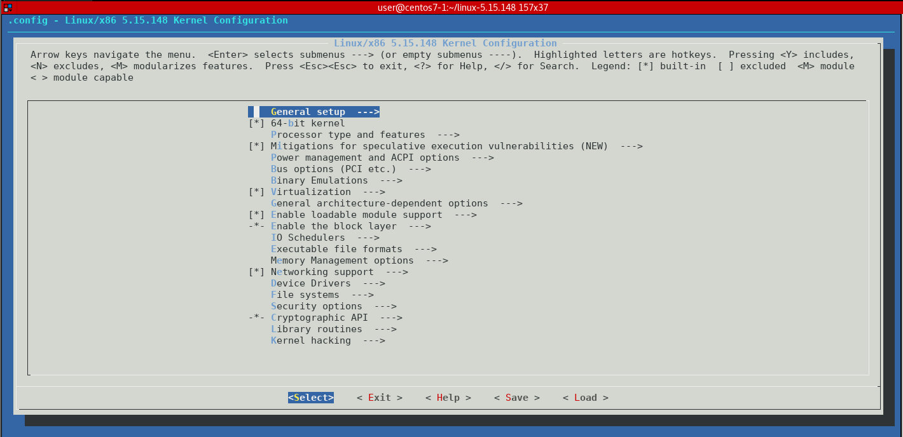  

> 其中
> * `[*]`代表此功能會直接編譯到Kernel中
> * `[M]`表示此功能會編譯為模組，有需要時才會載入Kernel
> * `[ ]`表示不會載入此功能

不須改動此頁設定，直接用右方向鍵選取`< Exit >`儲存並退出  

輸入以下指令開始編譯Kernel並更改開機程式設定：  

```
# make bzImage
# make modules
# make
# make modules_install
# make install
# grub2-mkconfig -o /boot/grub2/grub.cfg
```

完成後，使用`reboot`重新開機，若更新成功即可在開機頁面選取對應版本的Kernel  

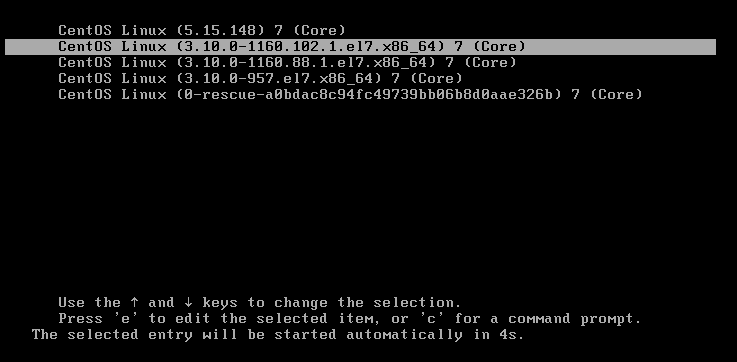  

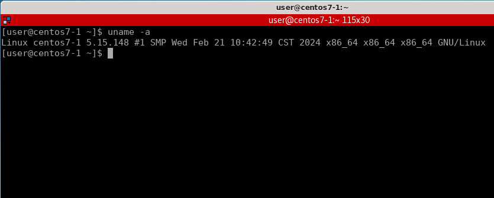  

### Kernel模組管理

* `lsmod`：列出已載入Kernel的模組  
* `rmmod`：移除載入的模組  
* `modinfo`：查看模組的基本訊息  
* `insmod`：載入模組（需使用完整檔名）  
* `modprobe`：會主動搜尋`modules.dep`的內容，依據模組的相依性自動載入需要的模組  

> 參考資料：  
> [Linux内核模块管理：lsmod、insmod、rmmod、modinfo、modprobe、depmod命令详解][linuxModuleManagement]  
> [核心模組的載入與移除：insmod,modprobe,rmmod][linuxModuleManagement1]

## Week 2 (2024/02/28)

***放假***

## Week 3 (2024/03/06)

### 網頁翻譯擴充元件

* [沈浸式翻譯：雙語對照網頁翻譯＆PDF文檔翻譯](https://chromewebstore.google.com/detail/immersive-translate-web-p/bpoadfkcbjbfhfodiogcnhhhpibjhbnh?utm_source=ext_app_menu)

### Nmap

使用Nmap掃描網路

* [Nmap入門教學](https://medium.com/璿的筆記本/nmap-入門教學-36ed094d6ef8)

### 使用Hydra攻擊ssh伺服器

* [Centos7安裝Hydra](https://www.cnblogs.com/ellisonzhang/p/13440614.html)

**後面太麻煩我就沒做了（攻擊的部份）**

### 關閉ssh的帳號密碼登入,讓使用者採用rsa key進行登入

> server -> `centos7-2`, ip: 192.168.241.101  
> client -> `centos7-1`, ip: 192.168.241.100

1. 在client端產生ssh rsa key（如果沒有的話）
    ```
    ssh-keygen
    ```

2. 將client端的公鑰複製到server端  
    * ex:
        ```
        scp ~/.ssh/id_rsa.pub user@192.168.241.100:/home/user/.ssh/centos7-1.pub
        ```

3. 在server端更改`authorized_keys`檔案  
    * ex:
        ```
        cat .ssh/centos7-1.pub >> authorized_keys
        ```

4. 關閉ssh伺服器的密碼驗證功能（server端）
    * 修改`/etc/ssh/sshd_config`，其中的：
        ```
        PasswordAuthentication yes
        ```
        將`yes`改為`no`  
        存檔後重啟sshd  
        ```
        systemctl restart sshd
        ```

* 若**無法登入**：
    1. 檢查`selinux` and `firewalld`
    2. 檢查`.ssh`資料夾及`authorized_keys`檔案權限
        * `.ssh` 權限須為`700`
        * `authorized_keys`權限須為`600`
    3. 檢查server端的家目錄權限，須為`755`
        * ex:  
            ```
            drwxr-xr-x. 34 user user 4096 Mar 15 16:18 /home/user
            ```

* 參考資料：[SSH Authentication Refused: Bad Ownership or Modes for Directory](https://chemicloud.com/kb/article/ssh-authentication-refused-bad-ownership-or-modes-for-directory/)

#### 練習

使用`powershell 7`以進行`ssh`連線  
方法相同  
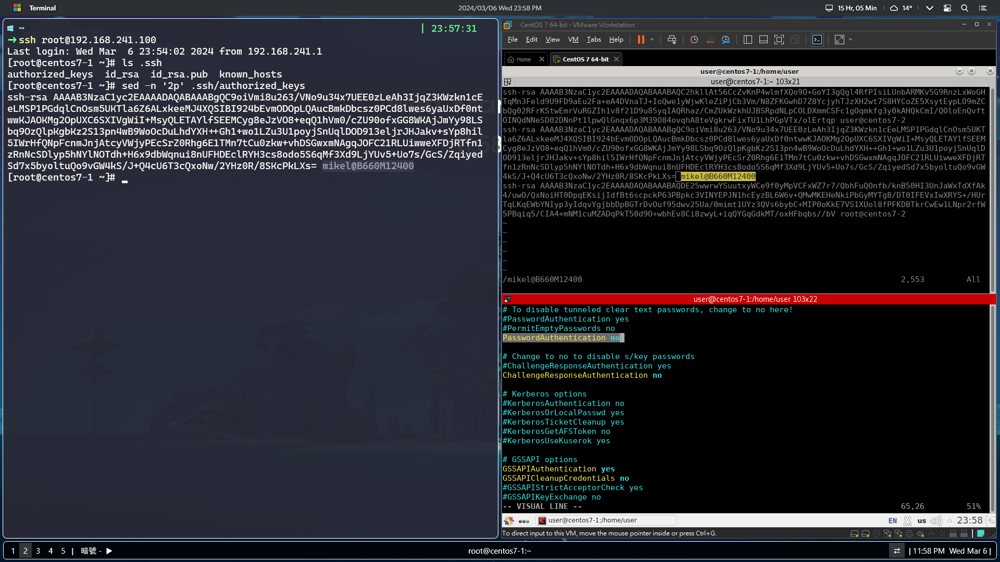

### linux 驅動程式 hello world

1. 建立`hello`資料夾

2. 建立`hello/hello.c`檔案

    ```c
    #include <linux/init.h>
    #include <linux/module.h>

    MODULE_DESCRIPTION("Hello_world");
    MODULE_LICENSE("GPL");

    static int hello_init(void)
    {
            printk(KERN_INFO "Hello world !\n");
                return 0;
    }

    static void hello_exit(void)
    {
            printk(KERN_INFO "ByeBye !\n");
    }

    module_init(hello_init);

    module_exit(hello_exit);
    ```

3. 建立`hello/Makefile`檔案
    ```make
    obj-m += hello.o
    KVERSION := $(shell uname -r)

    all:
        $(MAKE) -C /lib/modules/$(KVERSION)/build M=$(PWD) modules

    clean:
        $(MAKE) -C /lib/modules/$(KVERSION)/build M=$(PWD) clean
    ```

4. 在`hello`資料夾中使用`make`指令

5. 使用`insmod {path/to/hello/hello.ko}`指令載入模組

6. 使用`rmmod hello`移除模組

7. 使用`dmesg`檢查是否成功  
    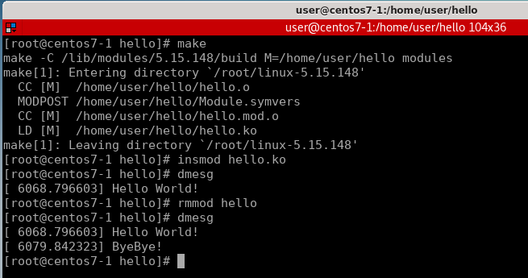  

* 發現如下圖錯誤  
    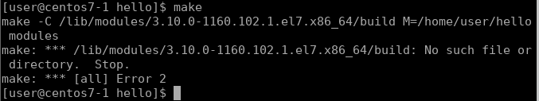  
    進入`/usr/src/kernels/`檢查有沒有相應的內核開發工具，如果沒有  
    
    ```sh
    UNAME=$(uname -r)
    yum install gcc kernel-devel-${UNAME%.*}
    ```

**記得要使用新版gcc**  
* gcc更新指令：  

    ```sh
    yum -y install centos-release-scl
    yum -y install devtoolset-7-gcc devtoolset-7-gcc-c++ devtoolset-7-binutils
    scl enable devtoolset-7 bash
    ```  

* 參考資料：
    * [[Linux Kernel] 撰寫簡單 Hello, World module (part 1).](https://blog.wu-boy.com/2010/06/linux-kernel-driver-撰寫簡單-hello-world-module-part-1%2f)
    * [make: \*** /lib/modules/3.10.0-693.el7.x86_64/build: 没有那个文件或目录](https://blog.csdn.net/u012343297/article/details/79141878)

## Week 4 (2023/03/13)

### WebDAV

1. `yum install -y epel-release httpd`
2. `httpd -M | grep dav`  
    確定有這三個模組  
    ```
    dav_module
    dav_fs_module
    dav_lock_module
    ``` 
3. `mkdir /var/www/html/webdav`
4. `cd /var/www/html/webdav`
5. `touch {a..d}.txt`
6. `vim /etc/httpd/conf.d/webdav.conf`
    ```apacheconf
    DavLockDB /var/www/html/DavLock
    <VirtualHost *:80>
        ServerAdmin webmaster@localhost
        DocumentRoot /var/www/html/webdav/
        ErrorLog /var/log/httpd/error.log
        CustomLog /var/log/httpd/access.log combined
        Alias /webdav /var/www/html/webdav
        <Directory /var/www/html/webdav>
            DAV On
            #AuthType Basic
            #AuthName "webdav"
            #AuthUserFile /etc/httpd/.htpasswd
            #Require valid-user
        </Directory>
    </VirtualHost>
    ```
7. `chmod -R 755 /var/www/html` 變更資料夾權限  
8. `chown -R apache:apache /var/www/html` 變更資料夾擁有者  
9. `systemctl restart httpd.service` 重啟伺服器  

* 使用Windows檔案總管連線存取  
    1. 在`本機`按右鍵，選擇`連線網路磁碟機...`  
        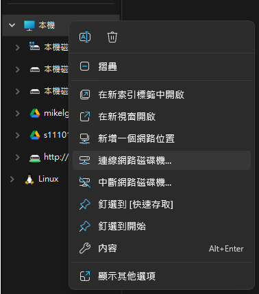  
    2. 選擇磁碟機代號並輸入伺服器ip  
        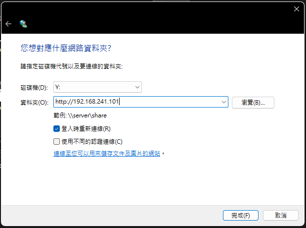

* 使用另一台linux虛擬機連線存取  
    1. 安裝`davfs2`  
        ```
        yum install -y davfs2
        ```
    2. 掛載WebDAV磁碟  
        ```
        mkdir /cloud
        mount -t davfs http://192.168.241.101 /cloud
        ```

* 掛載範例  
    windows:  
    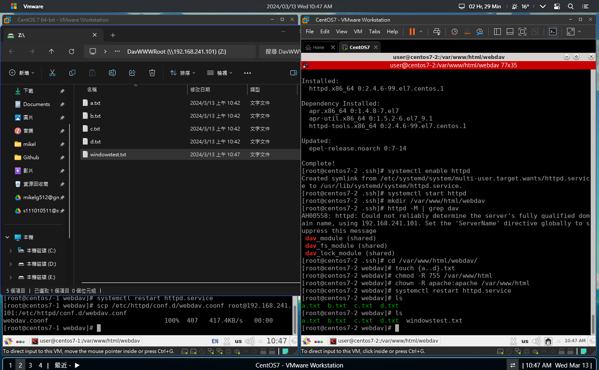  
    
    linux:  
    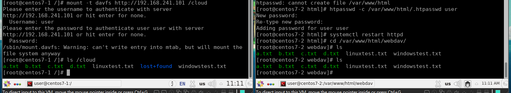

* 參考資料：  
    [學姐筆記](https://hackmd.io/@jenny126/By8OS6Fas/%2FiiMobAxzR3--0JSa_JNwVw)  
    [Linux将WebDAV为本地磁盘](https://blog.lincloud.pro/archives/36.html)

### linux 三劍客： `awk`, `grep`, `sed`

#### sed

* 參考資料：  
    [學姐筆記](https://hackmd.io/@jenny126/By8OS6Fas/%2FiiMobAxzR3--0JSa_JNwVw#Windows-Sedstream-editor)  
    [Linux sed 字串取代用法與範例](https://shengyu7697.github.io/linux-sed/)  
    [Linux 以 sed 指令搜尋、取代檔案內容教學與範例](https://officeguide.cc/linux-sed-find-and-replace-text-in-file-tutorial-examples/)  
    [Linux 指令 SED 用法教學、取代範例、詳解](https://terryl.in/zh/linux-sed-command/)  

## Week 5 (2024/03/20)

### 通配符/萬用字元 (Wildcard character)

* **通配符**用來批配檔案名稱，**正則表達式**用來匹配內容

| 通配符 | 作用 |
| :--- | :--- |
| `?` | 匹配一個任意字元 |
| `*` | 匹配零個或一個或多個任意字元 |
| `[]` | 匹配單個範圍內的任意字元 |

* ex:  
    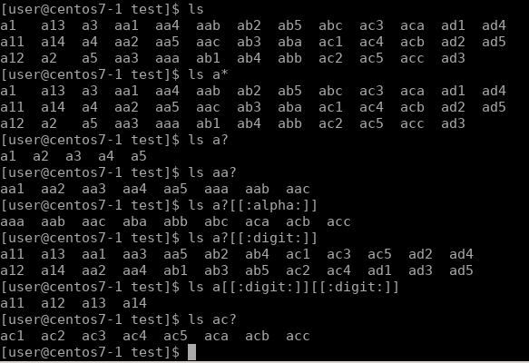

* 參考資料：[通配符| Linux基础概要](https://abcfy2.gitbooks.io/linux_basic/content/first_sense_for_linux/command_learning/wildcard.html)

### 正則表達式/正規表示式 (Regular Expression / RE)

* ex: 找出系統的帳號  
    ```
    grep -n nologin$ /etc/passwd
    ```
    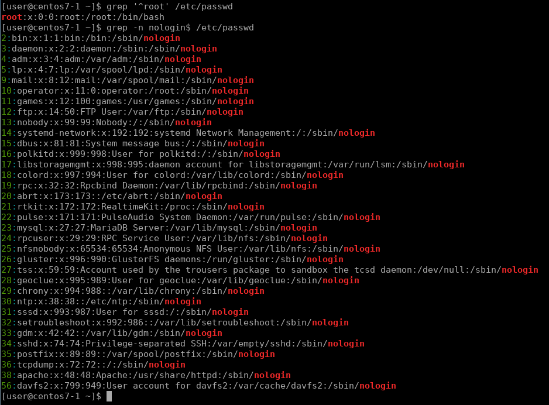

* 參考資料：[linux 正则表达式详解](https://cloud.tencent.com/developer/article/1683785), [正規表示式-維基百科](https://zh.wikipedia.org/wiki/正则表达式)

### linux 三劍客： `awk`, `grep`, `sed` - 2

#### grep

看[上面](#正則表達式正規表示式-regular-expression--re)

#### sed

取代用法類似於`vim`的搜尋並取代字串  

* 參考資料：[Linux文字三劍客超詳細教學---grep、sed、awk](https://tw511.com/a/01/11537.html)

#### awk

* 參考資料：[【CHT智能稅務案】教學筆記 03：awk 指令介紹](https://hackmd.io/@cht-fia-project/ryuiv7O2Y)

#### 練習

Windows Powershell 中的 `Get-Process`指令輸出格式為：  
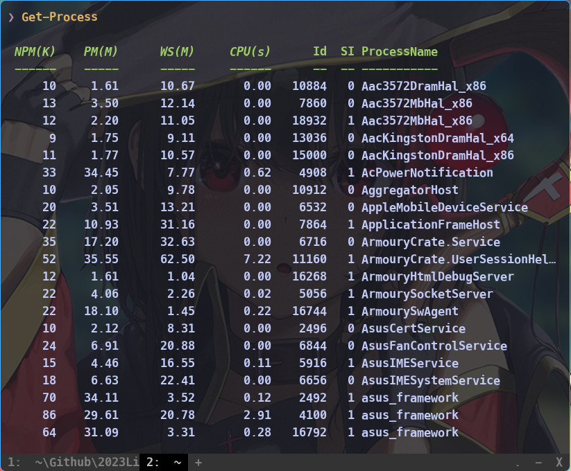  

* 先用`sed`得到`Get-Process`指令的目標欄位位置（`process name`和`pid`），再用`grep`和`awk`指令找到`process name`為 **pythonw** 的 `pid`  
    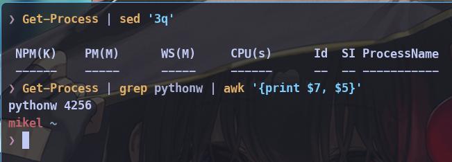

* 更簡單的方法：  
    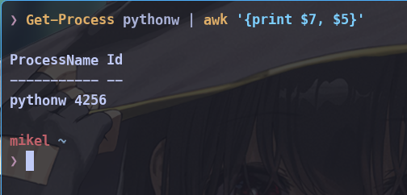  

## Week 6 (2024/03/27)
### Docker
#### 安裝最新版：  
##### Uninstall old versions:  
```
sudo yum remove docker \
                docker-client \
                docker-client-latest \
                docker-commom \
                docker-latest \
                docker-latest-logrotate \
                docker-logrotate \
                docker-engine
```  

##### Install from rpm repository:  
> Set up the repository
```
sudo yum install -y yum-utiils
sudo yum-config-manager --add-repo https://download.docker.com/linux/centos/docker-ce.repo
```  

> Install Docker Engine
```
sudo yum install docker-ce docker-ce-cli containerd.io docker-buildx-plugin docker-compose-plugin
```  

#### 開啟Docker服務
```
sudo systemctl enable docker
sudo systemctl start docker
```  

#### 測試是否安裝成功
```
sudo docker run hello-world
```

#### Docker 常用指令
* **Docker 指令都要在管理員權限下執行**

* 下載image:  
    ```
    docker pull [user_name/]{repo_name}[:tag]
    ```

* 完整的Docker image名稱格式：  
    `registry_name/user_name/repo_name:tag`  
    預設的`Registry`是官方的`Docker Hub`  
    官方的映像檔（如`apache`、`ubuntu`等）的名稱格式通常只會有`repo_name`和`tag`

* 建立並執行container
    ```
    docker run {image name}
    ```

* 執行已建立的container
    ```
    docker start {container_name}
    ```

* 進入可互動的container
    ```
    docker attach {container name}
    ```

* 離開互動中的container  
    `Ctrl + p` -> `Ctrl + q`

* 列出執行中的container
    ```
    docker ps [-a] [-q]
    ```
    * `-a`：列出未執行的container
    * `-q`：只列出container id

* 停止執行中的container
    ```
    docker stop {container id or name}
    ```  
    停止所有執行中的container  
    ```
    docker stop `docker ps -q`
    ```

* 將容器commit為image  
    ```
    docker commit {container name or id} {image name:tag}
    ```  
    ex:  
    ```
    docker commit mybusybox1 mybusybox:test
    ```

* 參考資料
  * [[Day6]-新手學Docker 0x2](https://ithelp.ithome.com.tw/articles/10241572)
  * [快速建立你的第一個Docker服務](https://joshhu.gitbooks.io/dockercommands/content/Containers/DockerRun.html)
  * [了解 docker run 指令](https://ithelp.ithome.com.tw/articles/10239672)
  * [为什么在 docker 中运行 apache 时总离不开“-D FOREGROUND”？](https://wangyiguo.medium.com/为什么在-docker-中运行-apache-时总离不开-d-foreground-76dcd8c86f17)
 
## Week 7 (2024/04/04)
***春假***

## Week 8 (2024/04/10)
### Docker 續

* 建立並執行container  
    ```
    docker run [-i] [-t] [-d] [--name] [--rm] [-p] [-v] {image} [command] [args]
    ```
    * `-i`：`--interactive`，開啟標準輸入。
    * `-t`：連接終端機。
    * `-d`：背景執行。
    * `--name`：指定container名稱。
    * `--rm`：退出container後自動刪除。
    * `-p`：連接埠號。
    * `-v`：掛載路徑。  
    * `-e`：將環境變數傳入容器
    

    * ex:
        ```
        docker run -d --name www1 --rm -p 8000:80 -v /web:/var/www/html centos7:httpd2 /usr/sbin/apachectl -DFOREGROUND
        ```
        > 建立並啟動`centos7:httpd2`，將容器取名為`www1`，背景執行，關閉後自動刪除，連接主機`8000 port`到容器的`80 port`，掛載主機的`/web`路徑到容器的`/var/www/html`路徑，執行`centos7:httpd2`image中的`/usr/sbin/apachectl`（開啟apache伺服器），`-DFOREGROUND`使apache 伺服器在容器內的前景執行，讓容器不會在離開後自動關閉。  

        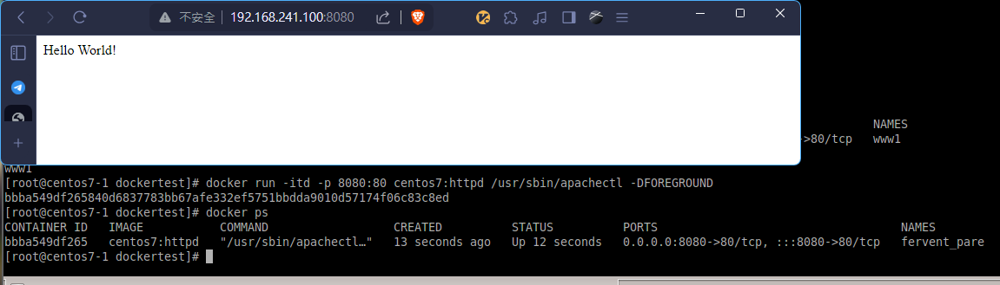


* 刪除所有container  
  ```
  docker rm `docker ps -aq`
  ```  

* 刪除所有container（包含執行中的）  
  ```
  docker rm -f `docker ps -aq`
  ```  

#### 使用Dockerfile建立image

ex:
```
mkdir testdocker
cd testdocker
touch index.html
echo "Hello World!" > index.html
vim Dockerfile
```
Dockerfile:
```dockerfile
FROM centos:centos7
RUN yum -y install httpd
EXPOSE 80
ADD index.html /var/www/html/
```

```
docker build -t centos7:httpd .
```
> 指令格式：  
> docker build -t {image名稱:tag} {build執行位置}

執行建立的image:
```
docker run -itd -p 8080:80 centos7:httpd /usr/sbin/apachectl -DFOREGROUND
```

測試：
```
curl 127.0.0.1:8080/index.html
```
有抓到`hello 2024`表示成功

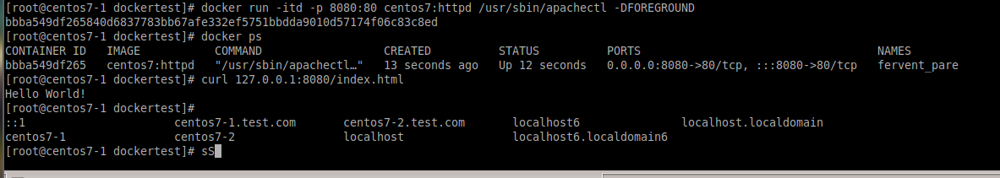

#### Dockerfile CMD(可覆蓋)、ENTRYPOINT(不可覆蓋)

```
FROM centos:centos7
RUN yum -y install httpd
EXPOSE 80
ADD index.html /var/www/html/
CMD ["/usr/sbin/apachectl", "-DFOREGROUND"]
```
建立：
```
docker build -t centos7:httpd2 .
```
執行：
```
docker run -itd -p 8081:80 centos7:httpd2
```
測試：
```
curl 127.0.0.1:8081/index.html
```

#### 參考資料
[Docker Dockerfile | 菜鸟教程](https://www.runoob.com/docker/docker-dockerfile.html)

#### Docker 擴容
docker啟動腳本 `testweb.sh`：
```bash
#!/usr/bin/bash

for i in {1..5}
do
    portno=`expr 8000 + $i`
    docker run -d -p $portno:80 -v /webdata:/var/www/html centos7:httpd2
done
```

```
chmod +x testweb.sh
```

* 執行
```
./testweb.sh
```
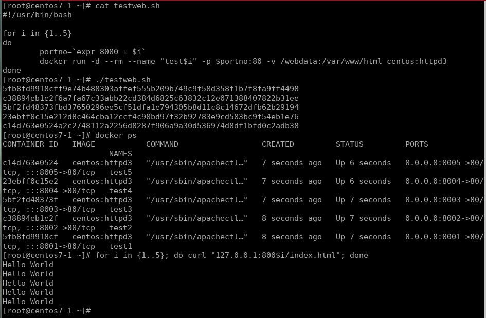

## Week 9 (2024/04/17)
### docker 備份和搬移

#### docker save & docker load

```
docker save {image name[:tag name]} > {filename}.tar
```

ex:
```
docker save centos7:httpd2 > test.tar
```

用`scp`把檔案複製到另一臺虛擬機
```
scp ./test.tar root@192.168.241.101:/tmp
```

在另一臺虛擬機載入備份
```
docker load < {filename}.tar
```

ex:
```
docker load < test.tar
```  
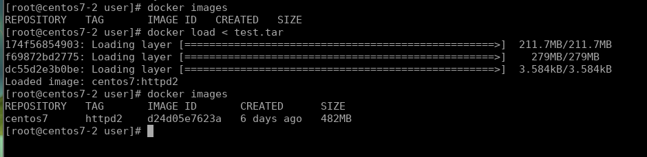

#### upload to docker hub

**先在docker hub註冊帳號，再到虛擬機裡登入**
```
docker login
```

以`busybox`為例操作：
```
docker pull busybox
```

```
docker run -it --name test1 busybox /bin/sh
```

在container中建立一些檔案作為修改：
```
/ # cd /tmp
/tmp # touch 1 2 3 4 5
/tmp # ls
1 2 3 4 5
/tmp # exit
```

使用`docker commit`建立image（dallas145是docker hub的username）：
```
docker commit test1 dallas145/mybusybox:0.1
```

> 補充：`docker tag`可為image產生別名  
> ex: `docker tag busybox mybusybox`

使用`docker push`將image推送至docker hub
```
docker push dallas145/mybusybox:0.1
```

完成後到docker hub查看
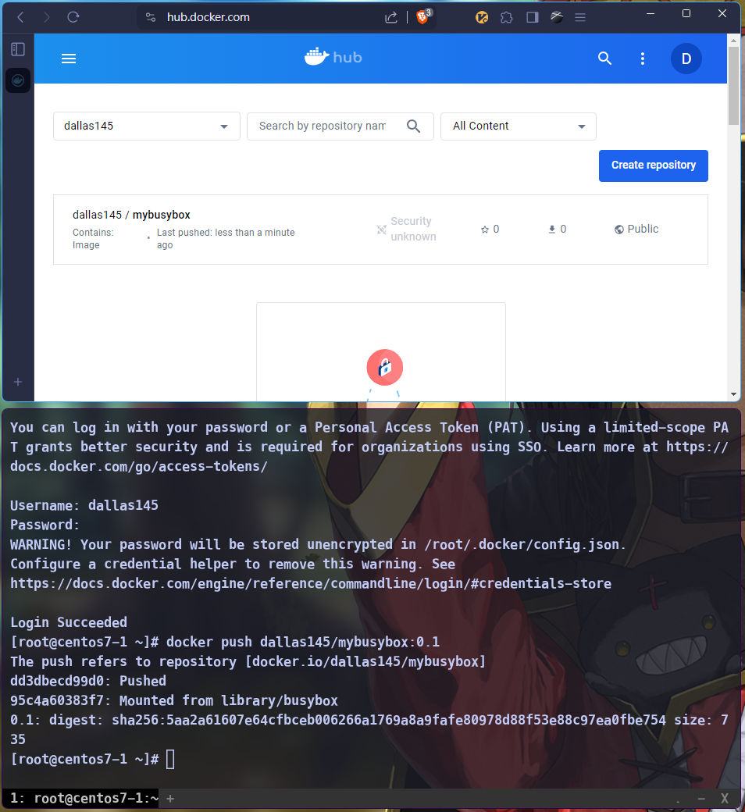

從docker hub下載：
```
docker pull dallas145/mybusybox:0.1
```

**補充：[用 Harbor 架設私有 Docker 倉庫. 用 Harbor 架設一個僅供公司內網存取的 Docker Registry | by 被蛇咬到的魯卡 | Starbugs Weekly 星巴哥技術專欄 | Medium](https://medium.com/starbugs/用-harbor-架設私有-docker-倉庫-9e7eb2bbf769)**

### load balancer
使用腳本建立伺服器：
```bash
for i in {1..5}
do
    mkdir -p /web$i
    echo $i > /web$i/hi.htm
    portno=`expr 8000 + $i`
    docker run -d -p $portno:80 -v /web$i:/var/www/html centos7:httpd2 /usr/sbin/apachectl -DFOREGROUND
done
```  
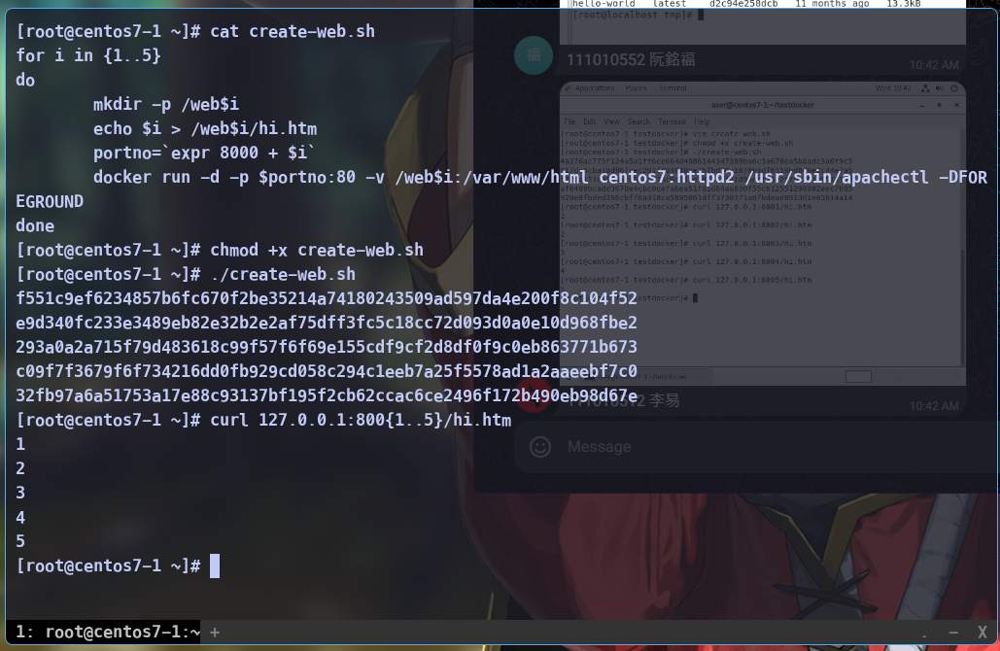

`haproxy`：
```
mkdir haproxy
cd haproxy
vim haproxy.cfg
```

haproxy.cfg:
```
defaults
  mode http
  timeout client 10s
  timeout connect 5s
  timeout server 10s
  timeout http-request 10s

frontend myfrontend
  bind 0.0.0.0:8080
  default_backend myservers

backend myservers
  balance roundrobin
  server server1 127.0.0.1:8001
  server server2 127.0.0.1:8002
  server server3 127.0.0.1:8003
  server server4 127.0.0.1:8004
  server server5 127.0.0.1:8005
```

執行haproxy：
```
docker run -d -p 8080:8080 --name my-haproxy -v /root/hptest:/usr/local/etc/haproxy:ro haproxy
```

測試：
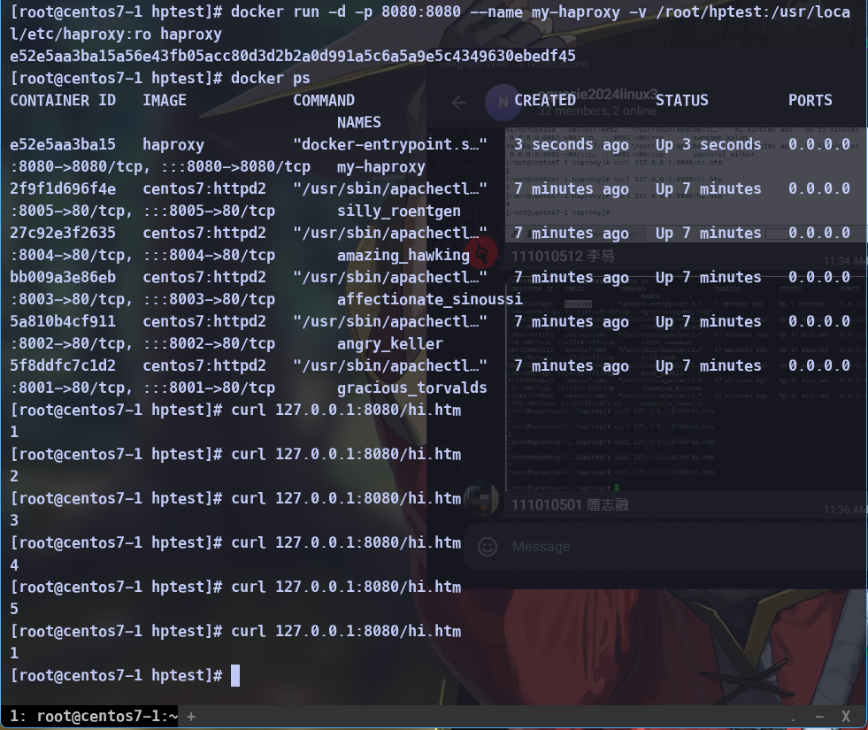

### docker network
查看docker網路：
```
docker network ls
```

查看docker網路詳細資訊：
```
docker network inspect {NETWORK ID}
```

建立docker network：
```
docker network create -d {type} {name}
```

**補充：[Docker四种网络模式（Bridge，Host，Container，None） - 大数据老司机 - 博客园](https://www.cnblogs.com/liugp/p/16328904.html)**  
* 用預設的`docker 0 bridge`網路，container之間只能用ip互連
* 用自己建立的`bridge`網路，container之間可以用ip或name互連

## Week 10 (2024/04/24)
### docker network
使用預設的 `docker 0` 網路，容器間只能使用 `ip` 連接；使用新增的網路，可使用 `container name` 連接。

### docker-compose
* install:
    
```
curl -L "https://github.com/docker/compose/releases/latest/download/docker-compose-$(uname -s)-$(uname -m)" -o /usr/local/bin/docker-compose && chmod +x /usr/local/bin/docker-compose && docker-compose --version
```

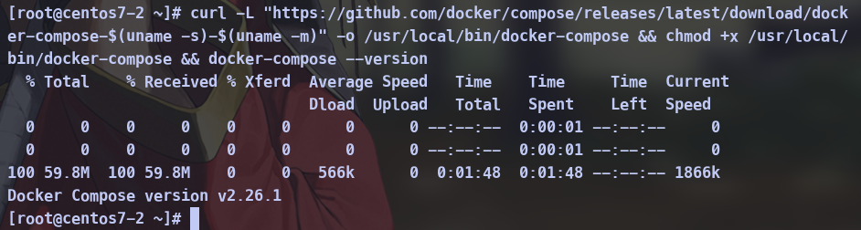

#### 實驗
使用兩台虛擬機，分別架設`MySQL`、`php`

##### 建立docker network
```
docker network create -d bridge mybr
```

##### MySQL
```
docker run -itd --name mysql -p 3306:3306 -e MYSQL_ROOT_PASSWORD=123456 mysql:5.7.24
```

啟動成功後，建立資料表與資料

```sql
/* 顯示目前有的資料庫 */
show databases;   
/* 創建資料庫 */
create database testdb;   
/*  使用資料庫 */
use testdb;  
/* 創建資料表 */
create table addrbook(name varchar(50) not null, phone char(10));
/* 加入資料 */
insert into addrbook(name, phone) values ("tom", "0912345678");
insert into addrbook(name, phone) values ("mary", "0987654321");
/* 選擇資料 */
select name,phone from addrbook;
/* */
update addrbook set phone="0987465123" 
```

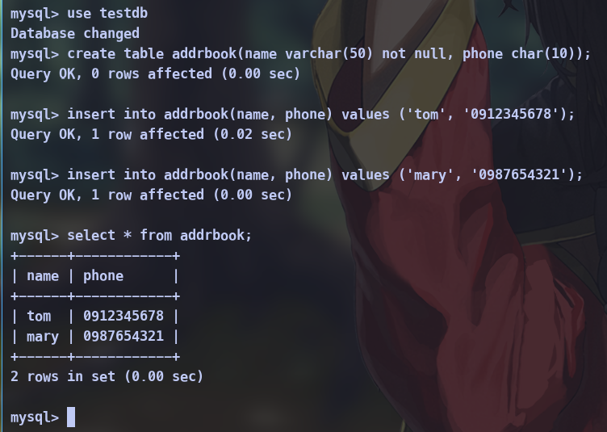

##### php
test.php:
```php
<?php
$servername="mydb";
$username="root";    
$password="123456";
$dbname="testdb";

$conn = new mysqli($servername, $username, $password, $dbname);

if($conn->connect_error){
    die("connection failed: " . $conn->connect_error);
}
else{
    echo "connect OK!" . "<br>";
}

$sql="select name,phone from addrbook";
$result=$conn->query($sql);

if($result->num_rows>0){
    while($row=$result->fetch_assoc()){
        echo "name: " . $row["name"] . "\tphone: " . $row["phone"] . "<br>";
    }
} else {
    echo "0 record";
}
?>
    
```
執行
```
docker run -d -p 8080:8080 --name my-apache-php-app --network mybr -v "/root/test-docker/php-code":/var/www/html php:7.2-apache
```

使用 `curl 127.0.0.1:8080/test.php` 測試會發現錯誤：

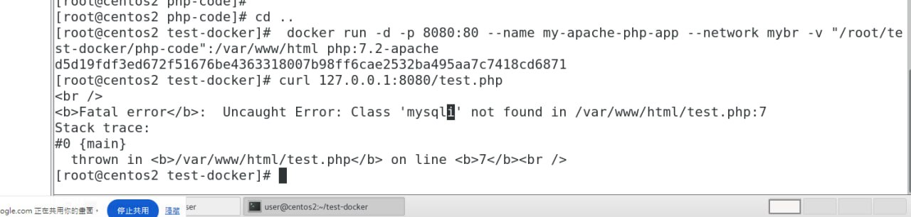

* 解法：
進入 `php` container 並安裝 `mysqli` 套件：

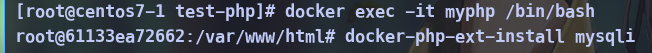

##### 成功結果
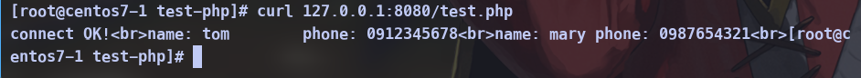

### docker volume

[Docker 實戰系列（三）：使用 Volume 保存容器內的數據 | by Larry Lu | Larry・Blog](https://larrylu.blog/using-volumn-to-persist-data-in-container-a3640cc92ce4)

### docker namespace

[理解Docker容器网络之Linux Network Namespace | Tony Bai](https://tonybai.com/2017/01/11/understanding-linux-network-namespace-for-docker-network/)

#### 練習
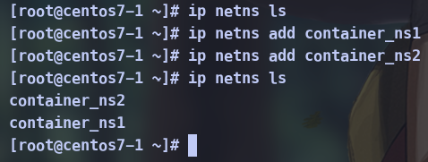

## Week 11 (2024/05/01)
### Gitlab - CI/CD (Continuous Delivery/Continuous Deplyment)
使用 `iris` 示範

建立 `train_model.py`:

```python
# coding: utf-8
import pickle
from sklearn import datasets
from sklearn.model_selection import train_test_split
from sklearn import tree

# simple demo for traing and saving model
iris=datasets.load_iris()
x=iris.data
y=iris.target

#labels for iris dataset
labels ={
	0: "setosa",
	1: "versicolor",
	2: "virginica"
}

x_train, x_test, y_train, y_test = train_test_split(x, y, test_size=.25)
classifier=tree.DecisionTreeClassifier()
classifier.fit(x_train,y_train)
predictions=classifier.predict(x_test)

#export the model
model_name = 'model.pkl'
print("finished training and dump the model as {0}".format(model_name))
pickle.dump(classifier, open(model_name,'wb'))
```

安裝`pip`:
```
yum install python-pip
```

```
python -m pip install pip==20.3.4
```

安裝`sklearn`:
```
pip install sklearn==
```

安裝完成後，執行 `train_model.py`:
```
python train_model.py
```

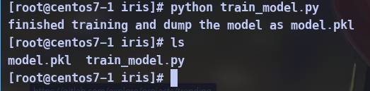

安裝 `flask`:
```
pip install flask
```

建立 `server.py`:
```python
# coding: utf-8
import pickle

from flask import Flask, request, jsonify

app = Flask(__name__)

# Load the model
model = pickle.load(open('model.pkl', 'rb'))
labels = {
  0: "versicolor",   
  1: "setosa",
  2: "virginica"
}

@app.route('/api', methods=['POST'])
def predict():
    # Get the data from the POST request.
    data = request.get_json(force = True)
    predict = model.predict(data['feature'])
    return jsonify(predict[0].tolist())

if __name__ == '__main__':
    app.run(debug = True, host = '0.0.0.0')
```

建立 `client.py`:
```python
# coding: utf-8
import requests
# Change the value of experience that you want to test
url = 'http://127.0.0.1:5000/api'
feature = [[5.8, 2.0, 4.2, 3.2]]
labels ={
  0: "setosa",
  1: "versicolor",
  2: "virginica"
}

r = requests.post(url,json={'feature': feature})
print(labels[r.json()])
```

啟動伺服器並使用客戶端連線：
```
python server.py
```
```
python client.py
```

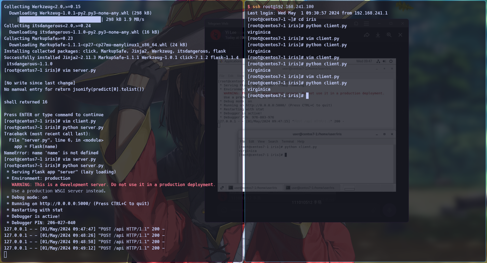

#### 將程式打包成docker image
下載基礎image作為基底：
```
docker pull nitincypher/docker-ubuntu-python-pip
```

建立 `Dockerfile`:
```dockerfile
FROM nitincypher/docker-ubuntu-python-pip

COPY ./requirements.txt /app/requirements.txt

WORKDIR /app

RUN pip install -r requirements.txt

COPY server.py /app

COPY train_model.py /app

CMD python /app/train_model.py && python /app/server.py
```

建立 `requirements.txt`
```
sklearn
flask
```

Build:
```
docker build -t iris:1.0 .
```

執行：
```
docker run -itd --name iris -p 5000:5000 iris:1.0
```

測試：
```
python client.py
```

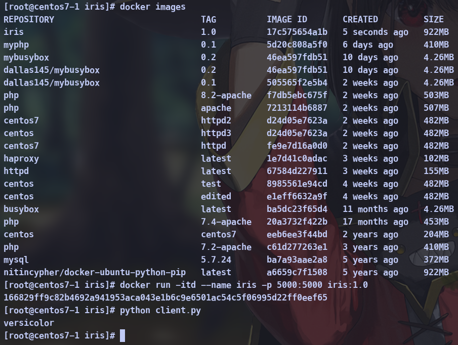

#### 透過Gitlab建立 CI/CD
設定`ssh`金鑰：
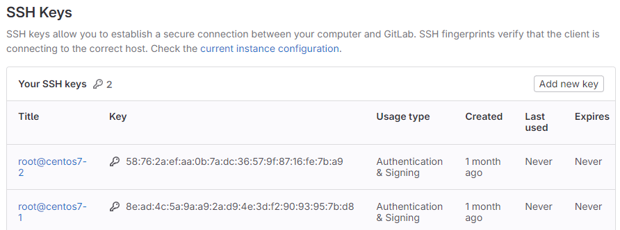

設定Git：
```
git config --global user.name "dallas145"
git config --global user.email "mikelg512@gmail.com"
```

將程式上傳至Gitlab:
```
git init
git remote add origin https://gitlab.com/dallas145/iris2024.git
git add .
git commit -m "First commit"
git push -uf origin main
```

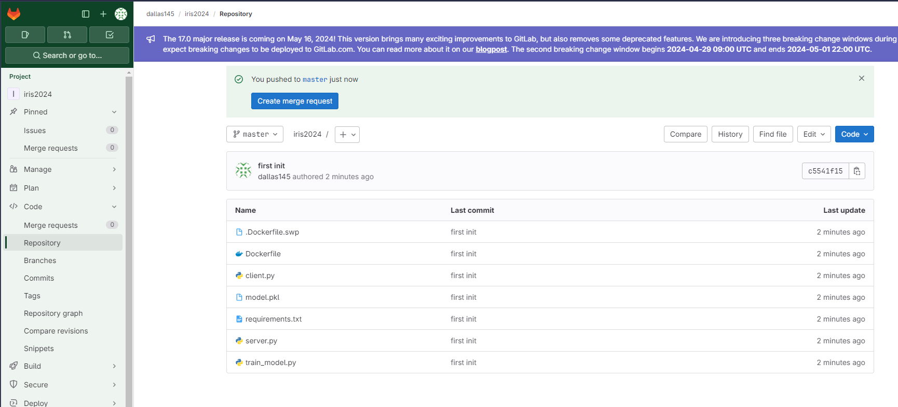

#### 建立Gitlab-runner
```
curl -L --output /usr/local/bin/gitlab-runner https://gitlab-runner-downloads.s3.amazonaws.com/latest/binaries/gitlab-runner-linux-amd64
```
```
chmod +x /usr/local/bin/gitlab-runner
```
```bash
useradd --comment "Gitlab Runner" --create-home gitlab-runner --shell /bin/bash
usermod -aG docker gitlab-runner
```
```
/usr/local/bin/gitlab-runner install --user=gitlab-runner --working-directory=/home/gitlab-runner
/usr/local/bin/gitlab-runner start
```

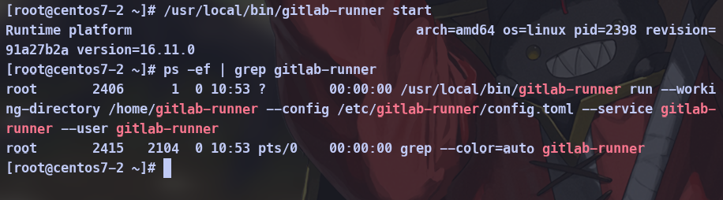

取得runner token:

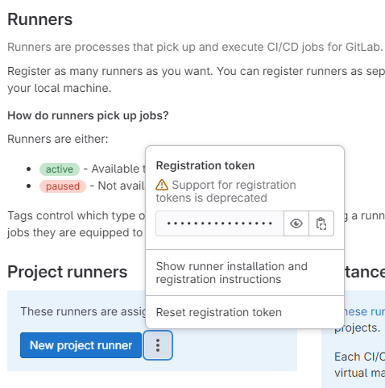

註冊runner:
```
gitlab-runner register
```

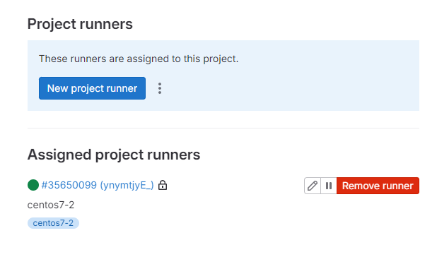

編輯`.gitlab-ci.yml`:
```yml
stages:
  - deploy

docker-deploy:
  stage: deploy
  script:
    - docker build -t iris .
    - if [ $(docker ps -aq --filter name=iris) ]; then docker rm -f iris; fi
    - docker run -d -p 5000:5000 --name iris iris
  tags:
    - centos7-2
```

將檔案推回gitlab:
```
git add .
git commit -m "update"
git push origin main
```

測試：

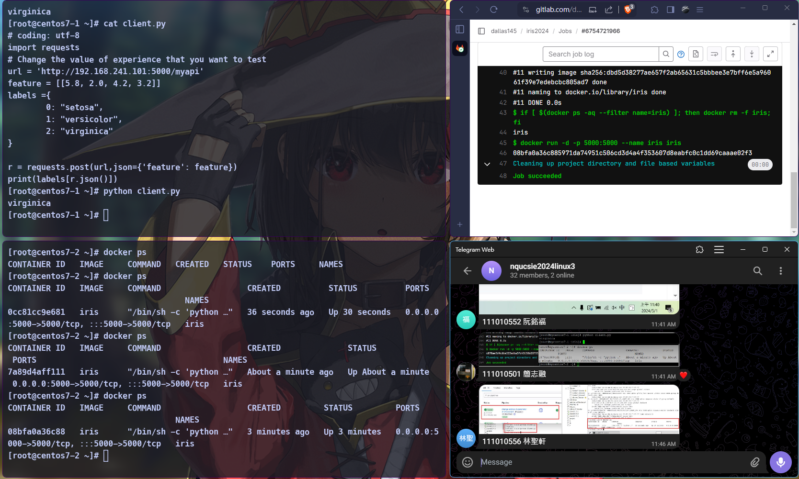

## Week 12 (2024/05/08)
### 補充
將程式輸出導向至檔案並在背景執行，避免程式佔用終端機。  
ex:  
`test.sh`:
```bash
#!/bin/bash

for i in {1..200}
do
    echo $i
    sleep 1
done
```
使用以下指令執行：
```
./test.sh > log 2>&1 &
```
可使用以下指令追蹤程式輸出：
```
tail -f log
```
若要防止關閉終端機造成程式中斷，可使用`nohup`指令：
```
nohup ./test.sh > log 2>&1 &
```
關閉終端機也不會影響執行中的程式。

**參考：[Linux 的 nohup 指令使用教學與範例，登出不中斷程式執行 – G. T. Wang](https://blog.gtwang.org/linux/linux-nohup-command-tutorial/)**

### docker-compose
確認已安裝docker-compose  


#### 範例一
```
mkdir test1 && cd test1
vim docker-compose.yml
```
docker-compose.yml:  
```yml
services:
  app:
    image: hello-world
```
啟動docker-compose:
```
docker-compose up
```
可使用`docker-compose ps`查看啟用的docker-compose:

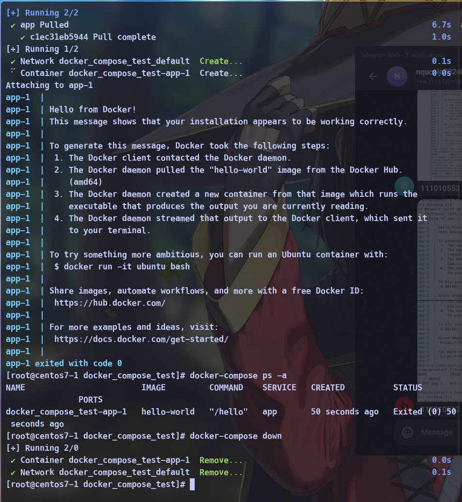

#### 範例二
```
mkdir test2 && cd test2
vim docker-compose.yml
```
docker-compose.yml:  
```yml
services:
  app:
    build:
      context: .
```
Dockerfile:  
```dockerfile
FROM alpine
	 
RUN apk add --no-cache bash
 
CMD bash -c 'for((i=1;;i+=1)); do sleep 1 && echo "Counter: $i"; done'
```
啟動：  
```
docker-compose build
```
```
docker-compose up -d
```
```
docker-compose logs # 查看程式執行進度
```
```
docker-compose down # 停止程式
```

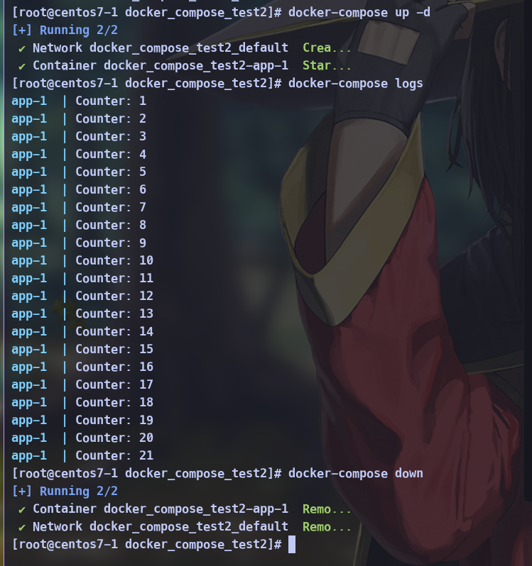

#### 範例三
覆蓋dockerfile中定義的指令
```
mkdir test3 && cd test3
vim docker-compose.yml
```
docker-compose.yml:  
```yml
services:
  app:
    build:
      context: .
    image: counter
    command: >
      bash -c 'for((i=1;;i+=2)); do sleep 1 && echo "Counter: $$i"; done'
```
Dockerfile:  
```dockerfile
FROM alpine
	 
RUN apk add --no-cache bash
 
CMD bash -c 'for((i=1;;i+=1)); do sleep 1 && echo "Counter: $i"; done'
```
啟動：  
```
docker-compose up -d
```

#### 範例四
掛載檔案目錄
```
mkdir /mydata && touch /mydata/{1..10}
mkdir test4 && cd test4
vim docker-compose.yml
```
Dockerfile:
```dockerfile
FROM centos:centos7
RUN yum -y install httpd
EXPOSE 80
ADD index.html /var/www/html
CMD ["/usr/sbin/apachectl","-DFOREGROUND"]
```
docker-compose.yml
```yml
services:
  app:
    build:
      context: .
    volumes:
      - /mydata:/docker-mydata
    ports:
      - "3000-3063:80"
```
測試：  
```
docker-compose up -d
docker-compose exec -it app bash
```

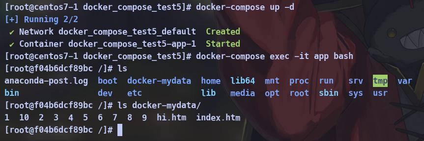

#### 範例五
```
mkdir test5 && cd test5
touch docker-compose.yml Dockerfile index.html
```
index.html:
```html
hello world
```
Dockerfile:
```dockerfile
FROM centos:centos7
RUN yum -y install httpd
EXPOSE 80
ADD index.html /var/www/html
CMD ["/usr/sbin/apachectl","-DFOREGROUND"]
```
docker-compose.yml
```yml
services:
  app:
    build:
      context: .
    ports:
      - "3000-3063:80"
```
啟動：
```
docker-compose up -d --scale app=5
```

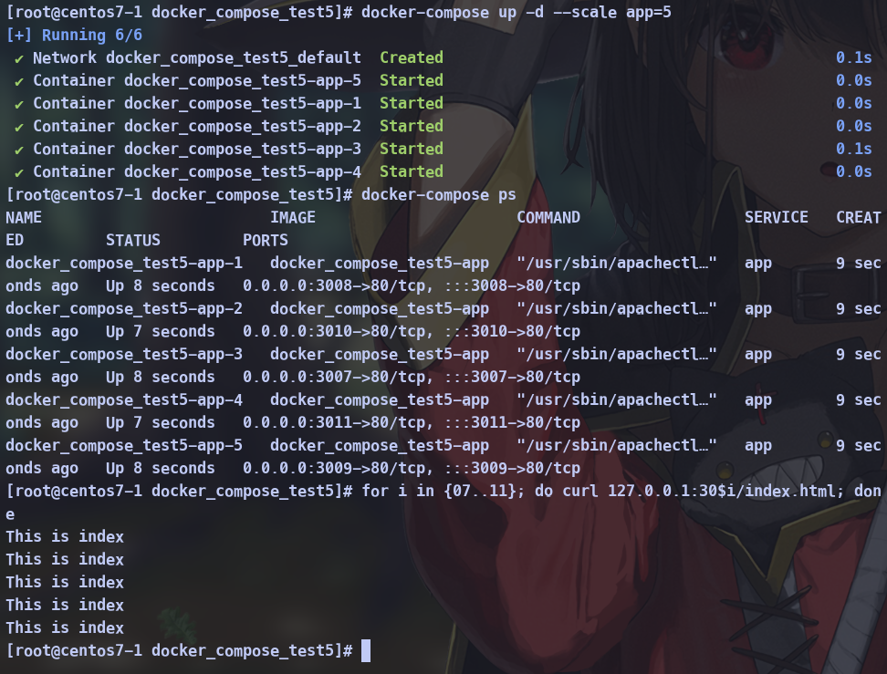

#### 範例六
```
mkdir test6 && cd test6
touch app.py docker-compose.yml Dockerfile requirements.txt
```
requirements.txt:  
```
flask
redis
```
Dockerfile:  
```dockerfile
FROM python
ADD . /code
WORKDIR /code
RUN pip install -r requirements.txt
CMD ["python", "app.py"]
```
app.py:
```python
from flask import Flask

app = Flask(__name__)
cache = redis.Redis(host='redis', port=6379)

def get_hit_count():
    retries = 5
    while True:
        try:
            return cache.incr('hits')
        except redis.exceptions.ConnectionError as exc:
            if retries == 0:
                raise exc
            retries -= 1
            time.sleep(0.5)

@app.route('/')
def get_index():
    count = get_hit_count()
    return "Yo! 你是第 {} 次瀏覽\n".format(count)

if __name__ == "__main__":
    app.runt(host="0.0.0.0", debug=True)
```
docker-compose:  
```yml
services:
  web:
    build: .
    ports:
      - "5000:5000"
    volumes:
      - .:/code
    depends_on:
      - redis
  radis:
    image: "redis:alpine"
```
啟動：
```
docker-compose up -d
```
測試：  

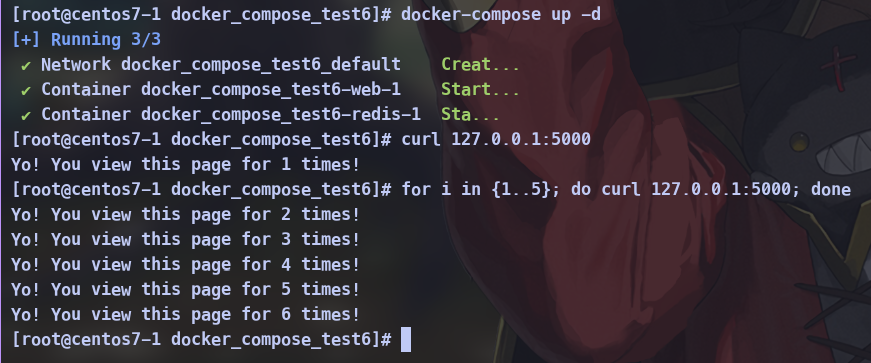

**參考資料：[利用 Dockfile、Docker Compose 建立 LAMP 環境 (PHP、Apache、MySQL) - HackMD](https://hackmd.io/@titangene/docker-lamp)**

## Week 13 (2024/05/15)
### 1Panel
安裝：  
```
curl -sSL https://resource.fit2cloud.com/1panel/package/quick_start.sh -o quick_start.sh && sh quick_start.sh
```

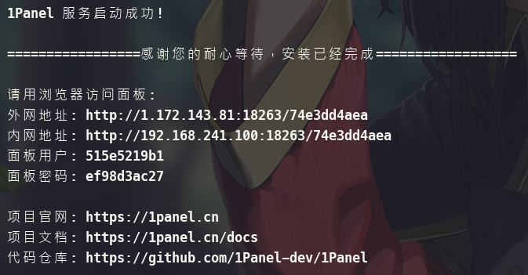

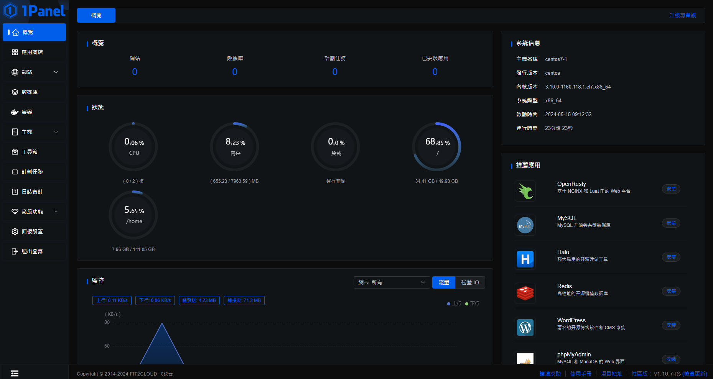

### Docker swawrm
開三台虛擬機  
7-1當manager  
7-2、7-3當node  
7-1初始化：  
```
docker swarm init --advertise-addr 192.168.241.100
```
複製顯示的指令，在另外兩台執行。
```
docker swarm join --token {剛剛複製的token}
```
可以在manager使用指令列出所有節點：  
```
docker node ls
```
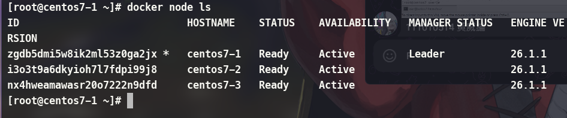

#### visualizer
```
docker service create --name=viz --publish=8080:8080/tcp --constraint=node.role==manager --mount=type=bind,src=/var/run/docker.sock,dst=/var/run/docker.sock dockersamples/visualizer
```

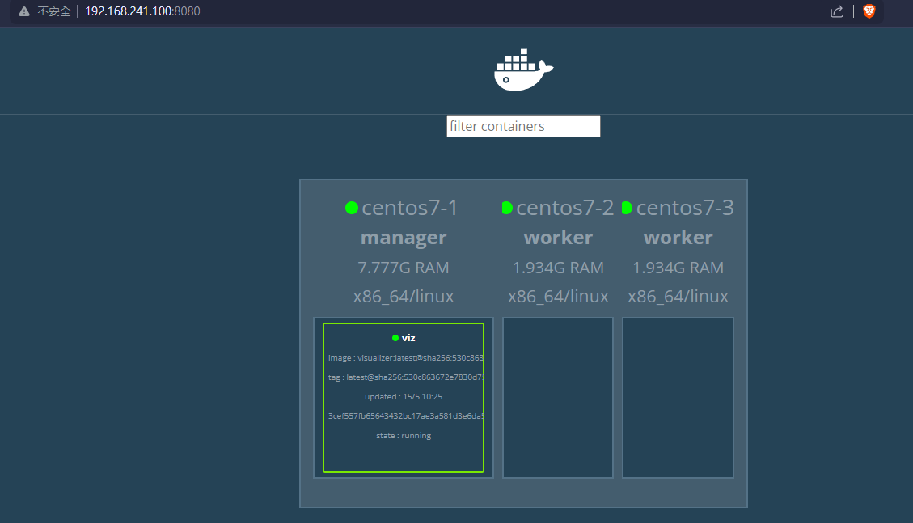

#### 範例
使用指令建立服務
```
docker service create  --name myweb httpd
```

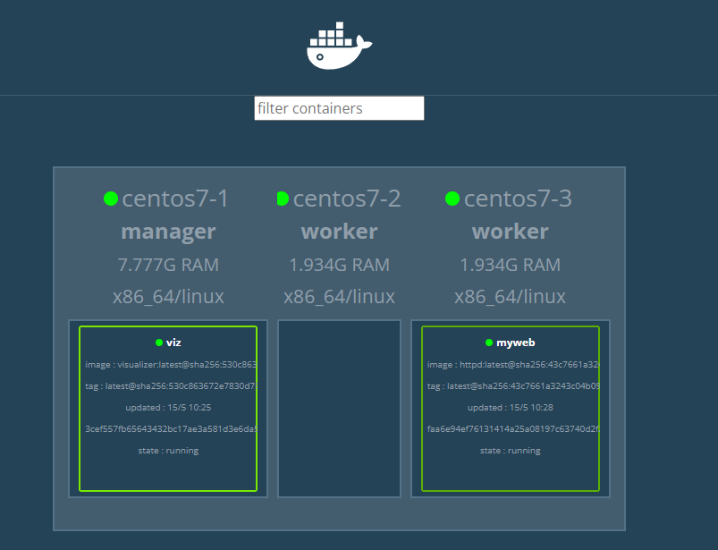

查看所有服務
```
docker service ls
```

#### 實驗
將centos7-3關機，模擬硬體錯誤。  
服務會自動轉移：  

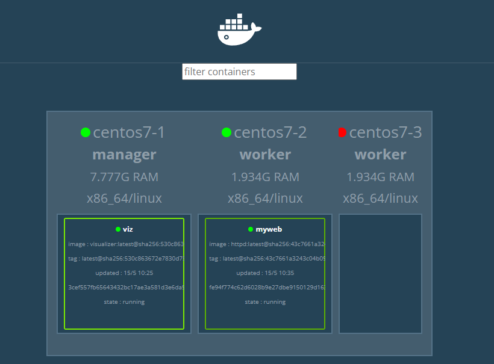

#### 擴容
```
docker service scale myweb=3
```

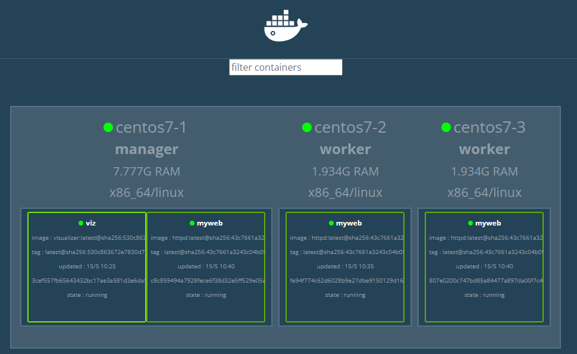

#### 讓節點不接收工作
```
docker node update --availability drain centos7-1
```

#### 重新接收新的工作
```
docker node update --availability active centos7-1
```

#### 移除服務
```
docker service rm myweb
```

#### 建立時就有副本
```
docker service create --name myweb --replicas 3 httpd
```

#### 開放服務對外連線
```
docker service update --publish-add 8081:80 myweb
```

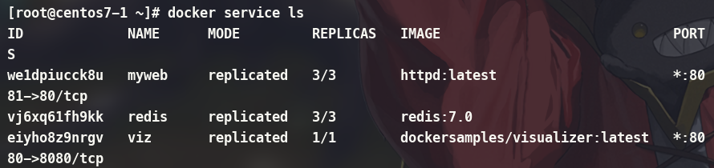

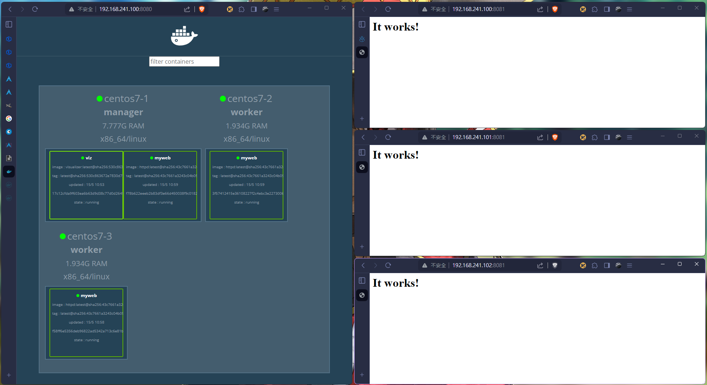

## Week 14 (2024/05/22)
### telegram ai bot
沒有做

### Docker swarm 實做
在master node(centos7-1) 建立以下資料夾，並安裝`nfs`
```
mkdir /mydb /myphp
```
```
yum install nfs-utils
```
啟動：
```
systemctl start rpcbind
systemctl start nfs
```
設定共享目錄  
`/etc/exports`:
```
/mydb/  192.168.241.0/24(rw,sync,no_root_squash,no_all_squash)
/myphp/  192.168.241.0/24(rw,sync,no_root_squash,no_all_squash)
```
重新啟動服務
```
systemctl restart rpcbind
systemctl restart nfs
```
檢查是否成功
```
showmount -e localhost
```

在worker node(centos7-2, centos7-3) 建立以下資料夾，並掛載到master node
```
mkdir /mydb /myphp
```
```
mount -t nfs 192.168.241.100:/mydb /mydb
mount -t nfs 192.168.241.100:/myphp /myphp
```

建立新的docker network
```
docker network create -d overlay mynet
```

建立`mydb`服務：
```
docker service create --name mydb --network mynet --mount type=bind,source=/mydb,target=/var/lib/mysql --env MYSQL_ROOT_PASSWORD=123456 --publish published=3306,target=3306 mysql
```

使用`docker service ls`檢視container name，並進入container
```
docker exec -it {container name} /bin/bash
```
使用mysql建立database
```
mysql -uroot -p
```
```
create datebase testdb;
```

使用`docker service rm mydb`刪除服務後，再次建立服務，資料不會不見。

#### 連結php
進到mydb，使用以下指令建立資料表。
```sql
create database testsql;
use testsql;
create table testtable(school char(5),name char(10),id int);
insert into testtable(school, name, id) values ('NQU','Jerry','123');
insert into testtable(school, name, id) values ('NQU','Amy','234');
```

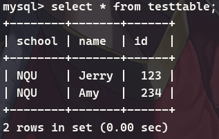

建立/myphp/test.php:
```php
<?php
$servername="mydb";
$username="root";
$password="123456";
$dbname="testsql";

$conn = new mysqli($servername, $username, $password, $dbname);

if($conn->connect_error){
	die("connecttion failed: " . $conn->connect_error);
}
else{
	echo "connect ok!" . "<br>";
}

$sql="select * from testtable";
$result=$conn->query($sql);

if($result->num_rows>0){
	while($row=$result->fetch_assoc()){
		echo "school: " . $row["school"] . "\tname: " . $row["name"] . "\tid: " . $row["id"] . "<br>";
	}
}else {
	echo "0 record";
}
?>
```
建立`myphp`服務：
```
docker service create --name myphp --network mynet --mount type=bind,source=/myphp,target=/var/www/html --publish published=8888,target=80 radys/php-apache:7.4
```
使用`curl`驗證：
```
curl 192.168.241.100:8888/test.php
```

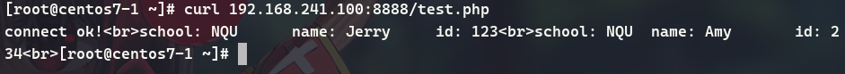

## Week 15 (2024/05/29)
### ansible
ansible 適合中小型的網路規模。

#### 前置動作
讓centos7-1（主控端）可以用ssh（無密碼）連上centos7-2、centos7-3（被控端）

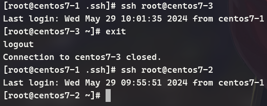

為了方便，編輯`/etc/hosts`，讓各虛擬機可以用名稱對應ip

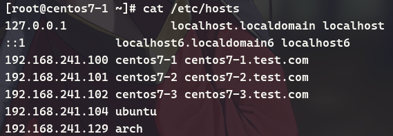

在主控端安裝ansible
```
yum install ansible
```

在主控端編輯`/etc/ansible/hosts`，加入以下內容：
```
[server1]
192.168.241.101 # centos7-2

[server2]
192.168.241.102 # centos7-3

[allservers]
centos7-2
centos7-3
```

使用指令檢查是否配置成功
```
ansible server1 -m ping
ansible server2 -m ping
ansible allservers -m ping
```

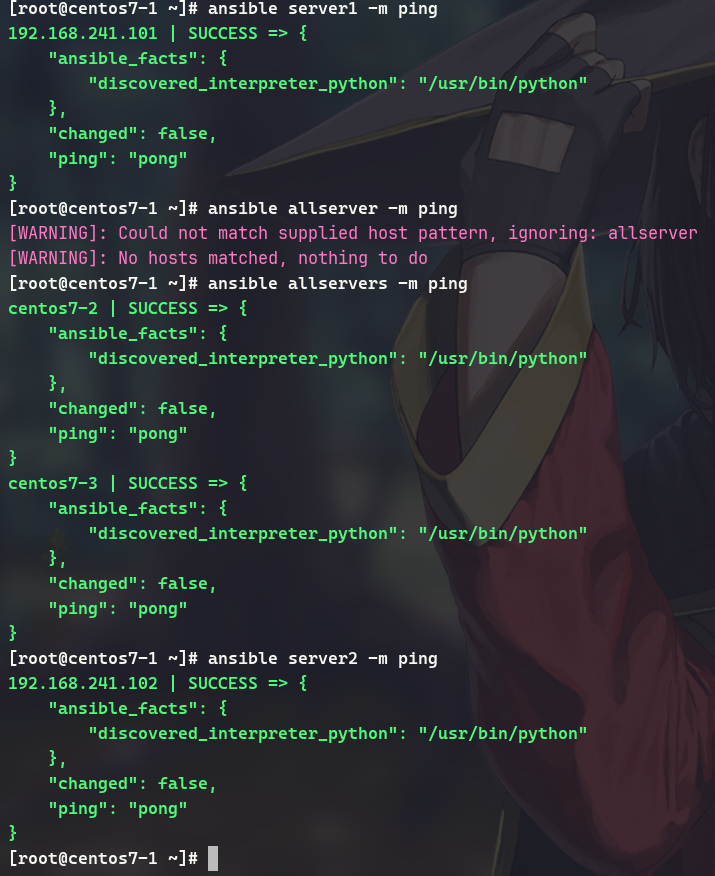

* 可使用 `ansible-doc -l` 列出所有可用模組。

#### 使用ansible-playbook
```
mkdir test-ansible && cd test-ansible
vim test1.yml
```
test1.yml:
```yml
---
- hosts: server1
  tasks:
    - name: test ping
      ping:
```
執行腳本
```
ansible-playbook test1.yml
```

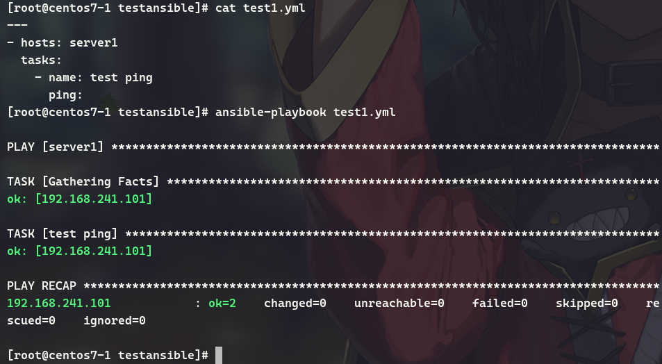

可使用指令蒐集被控端資訊
```
ansible server1 -m setup
```

**ansible command 模組只能執行較單一的指令，若指令較複雜，須使用 shell 模組。**  
在 shell 或 command 模組的指令中加入`chdir=路徑`，才能在指定路徑執行指令。

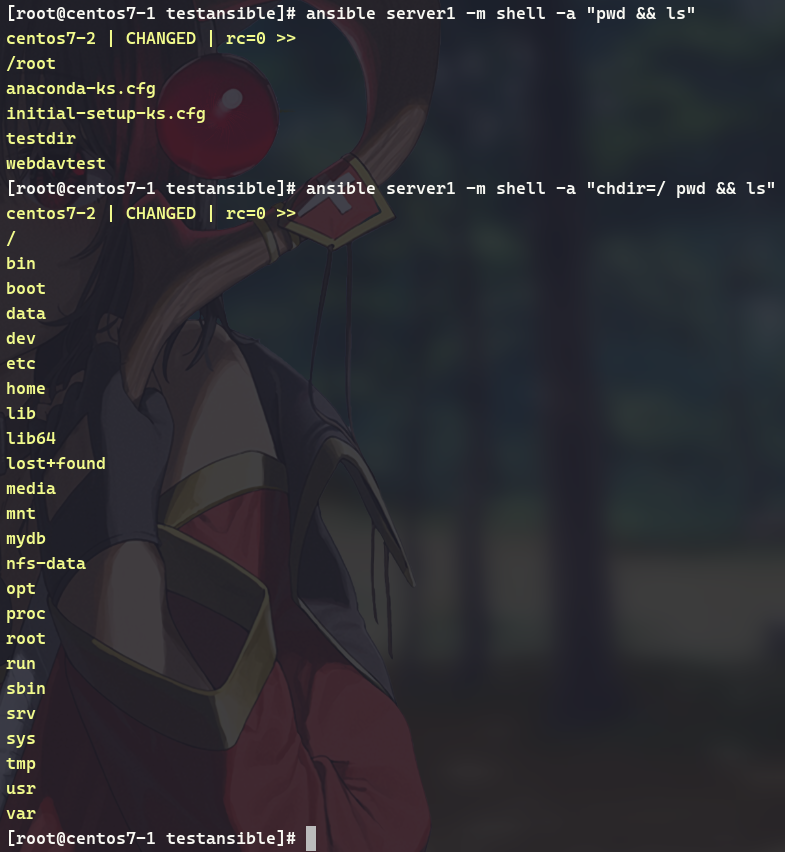

#### 範例
test2.yml:
```yml
---
- hosts: server1
  gather_facts: no
  tasks:
    - name: create an empty file under /tmp
      command:
        chdir: /tmp
        cmd: touch a.txt
    - name: list all files under /tmp and grep a
      shell:
        chdir: /tmp
        cmd: "ls -l | grep a.txt"
      register: results
    - name: show the results
      debug:
        msg: "{{ results['stdout'] }}"
```
執行：
```
ansible-playbook test2.yml
```

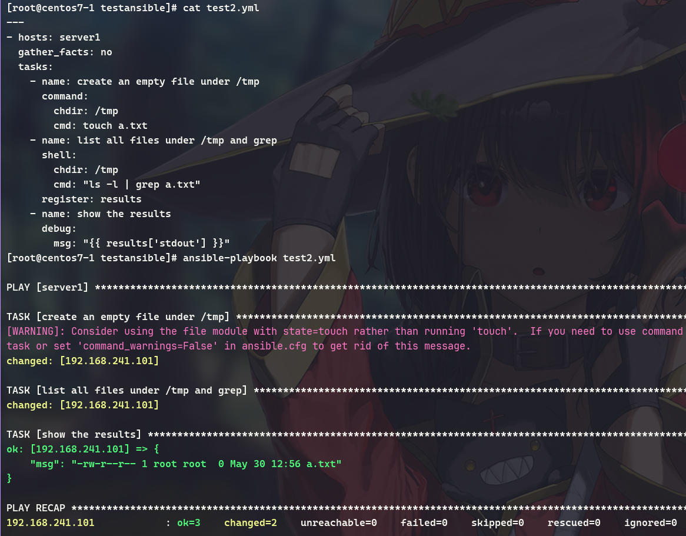

## Week 16 (2024/06/05)
### ansible
確認`ubuntu`虛擬機可以用ssh無密碼連線。  
**如果使用的是`ubuntu 24.04`，必須手動編譯安裝 python2 才可以正常使用centos7中較舊的ansible控制。可以參考[Ubuntu 20 编译安装 Python-2.7.18_python-2.7.18.tgz 包下载-CSDN博客](https://blog.csdn.net/lsqtzj/article/details/114298091)**

編輯`ubuntu`中的`/etc/ssh/sshd_config`，加入以下內容：
```
PermitRootLogin yes
```

編輯`/etc/ansible/hosts`，加入ubuntu（若使用額外安裝的python，需要加上 python 位置）:
```
[ubuntu]
192.168.241.104

[ubuntu:vars]
ansible_python_intepreter=/usr/local/bin/python
```
使用`ansible all -m ping`測試：

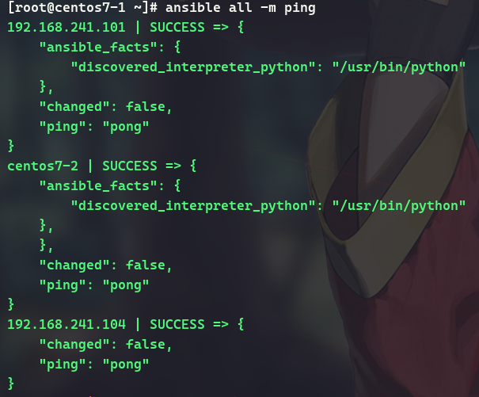

#### 範例
寫一個簡單的腳本`a.sh`：
```sh
hostname
```
變更權限：
```
chmod +x a.sh
```
使用ansible執行：
```
ansible all -m script -a "./a.sh"
```

#### 遠端複製
```
ansible server1 -m copy -a "src=./hello.txt dest=/tmp/hello.txt owner=user group=user mode=666"
```

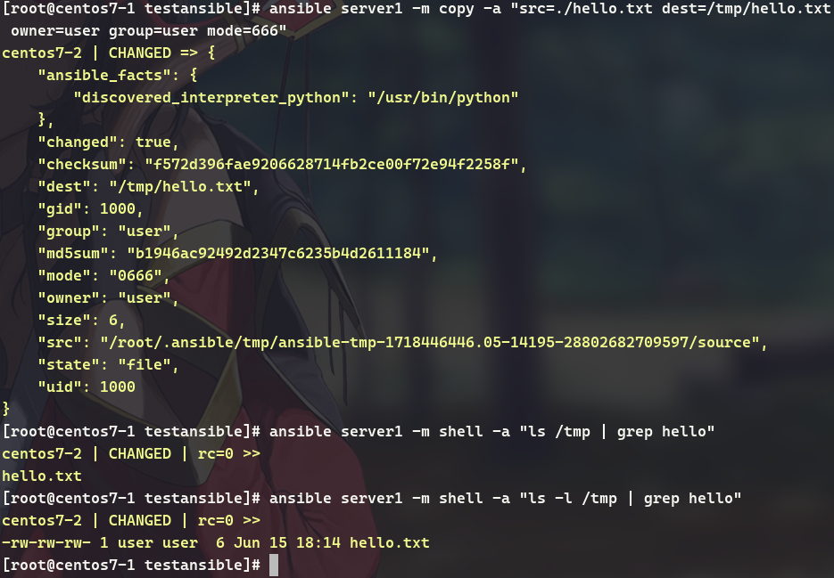

#### 變更檔案屬性
```
ansible server1 -m file -a "path=/tmp/hello.txt owner=root group=root mode=644"
```

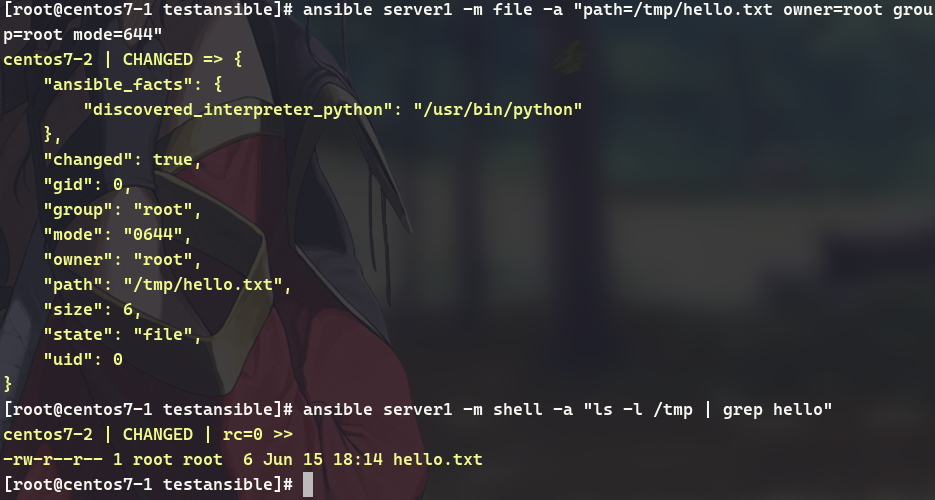

#### 控制服務
停止server1的httpd:
```
ansible server1 -m service -a "name=httpd state=stopped"
```
啟動server1的httpd:
```
ansible server1 -m service -a "name=httpd state=started"
```

#### 範例
```
touch hi.j2 test3.yml
```
hi.j2:
```
Hello "{{ dynamic_world }}"
```
test3.yml:
```yml
---
- hosts: server1
  gather_facts: no
  vars:
    dynamic_world: "World"
  tasks:
    - name: test template
      template:
        src: hi.j2
        dest: /tmp/hello_world.txt
```
執行：
```
ansible-playbook test3.yml
```

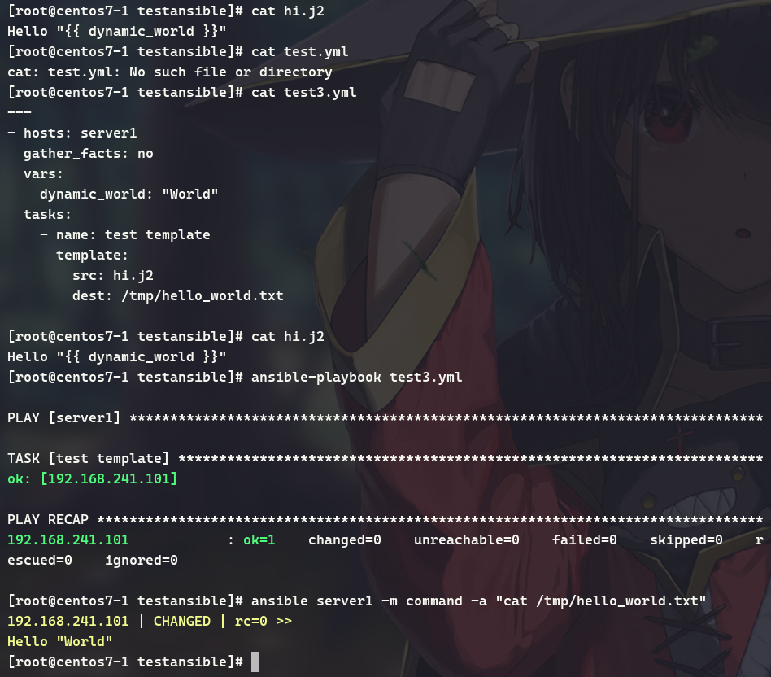

#### 範例
用 ansible 安裝 httpd 並將 httpd 的 port 改成 8080
hi.htm:
```
hi
```
httpd.conf.j2:  
複製 httpd 的預設配置檔，修改`Listen xx`:
```
Listen {{ portnum }}
```
test5.yml:
```yml
---
- hosts: server1
  gather_facts: no
  vars:
    portnum: 8080
  tasks:
    - name: install httpd
      yum:
        name:
          - httpd
        state: present
    - name: copy configuration file
      template:
        src: httpd.conf.j2
        dest: /etc/httpd/conf/httpd.conf
    - name: copy hi.htm
      copy:
        src: hi.htm
        dest: /var/www/html/hi.htm
    - name: restart httpd service
      service:
        name: httpd
        state: restarted
```
執行：
```
ansible-playbook test5.yml
```

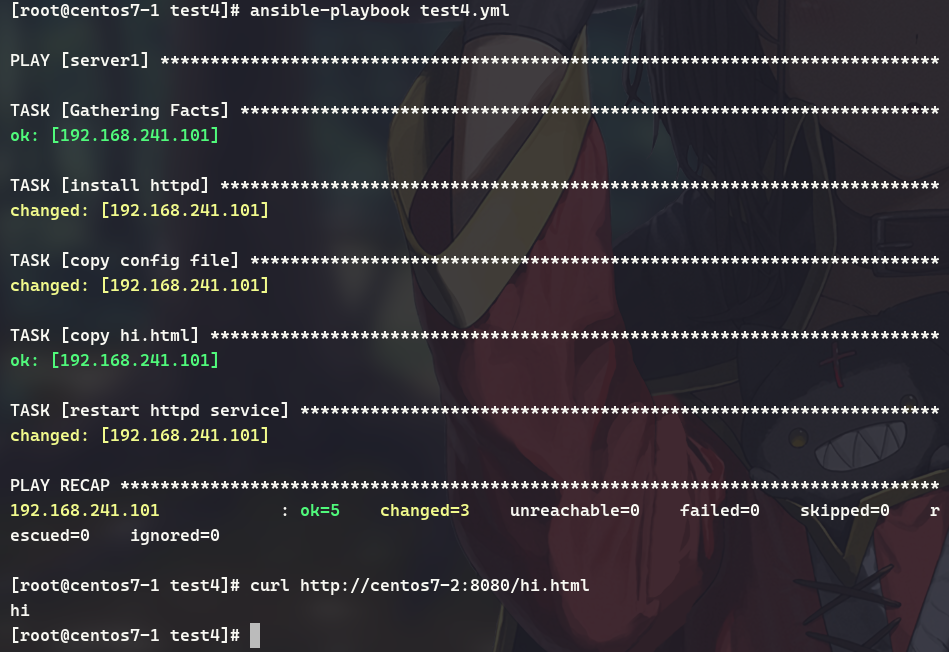

-----

[linuxModuleManagement]: https://blog.csdn.net/yangjizhen1533/article/details/112239092
[linuxModuleManagement1]: https://mingyi-ulinux.blogspot.com/2009/01/insmod-modprobe-rmmod.html
