---

marp: true
theme: uncover
paginate: true
header: RustDesk

---

<style>
header{
    text-align: left
}
</style>

<!-- transition: pull -->
<!-- class: invert -->

# 如何在Azure架設
# RustDesk中繼伺服器

**資工三 蔡松宏**

---

<!-- _transition: pull -->

# 目錄

- RustDesk
- Azure
- Ubuntu
- Docker

---


---

# RustDesk

RustDesk 是一款開源的遠端桌面軟體，
特別為跨平台的遠端桌面支援而設計。

---

# RustDesk 使用方式

* 在兩台設備都安裝 RustDesk Client

---

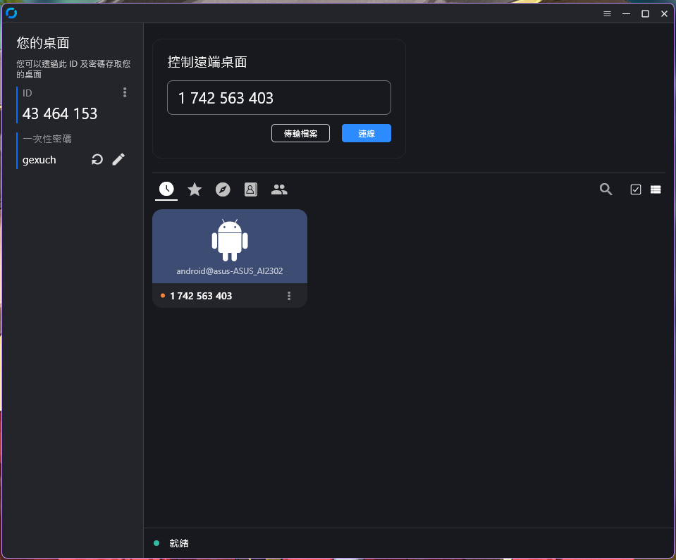

---

<!-- _transition: none -->

## 中繼伺服器

RustDesk 預設使用P2P連線
連線失敗後才會採用中繼伺服器連線

---

## 中繼伺服器

RustDesk 有提供免費的中繼伺服器
若有資安疑慮可以自架中繼伺服器

---

# Azure

---

<!-- _transition: none -->

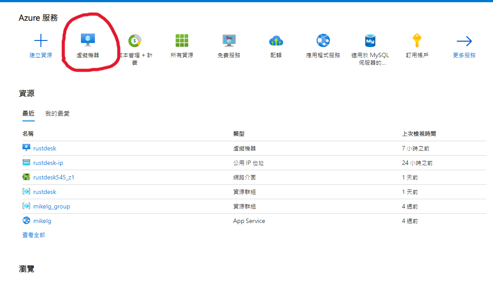

---

<!-- _transition: none -->

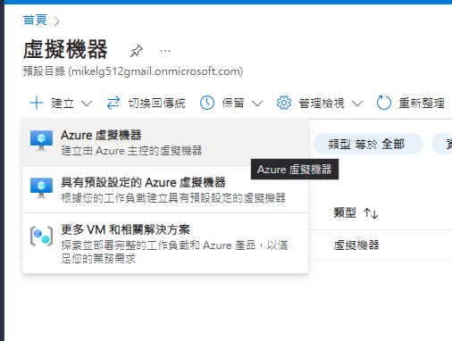

---

<!-- _transition: none -->

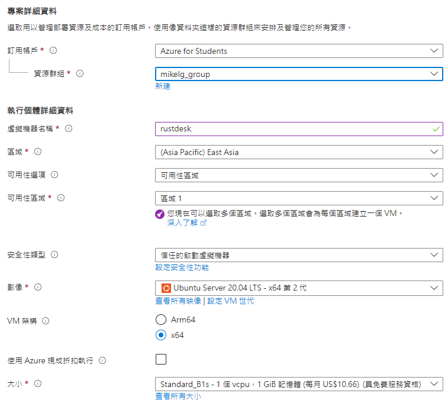

---

<!-- _transition: none -->

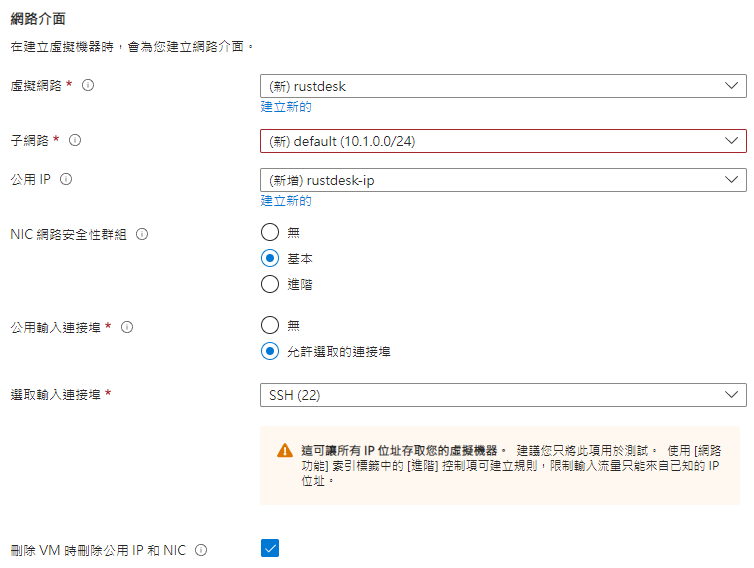

---

<!-- _transition: none -->

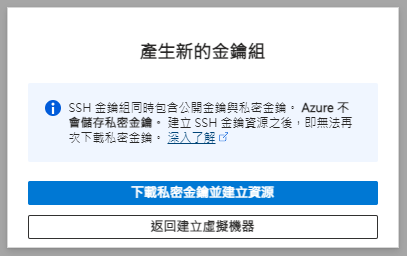

---

<!-- _transition: none -->

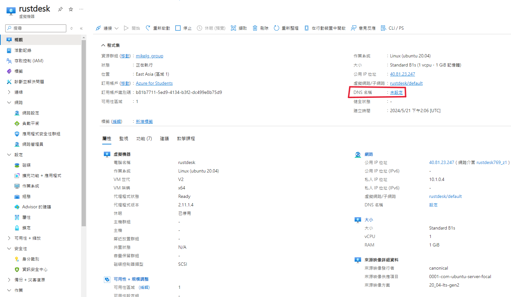

---

<!-- _transition: none -->

<style>
section.invert.lead p{
    text-align: left
}
</style>

<!-- _class: invert lead -->

### 設定DNS名稱

例：
```
rustdesk123
```

預設後綴：
```
.eastasia.cloudapp.azure.com
```

---

<!-- _class: invert lead -->

### 連線
開終端機：
```
ssh -i {path/to/key.pem} {username}@{server ip or domain name}
```

範例：
```
ssh -i ~/.ssh/azure_keys/rustdesk_key.pem azureuser@rustdesk123.eastasia.cloudapp.azure.com
```

---

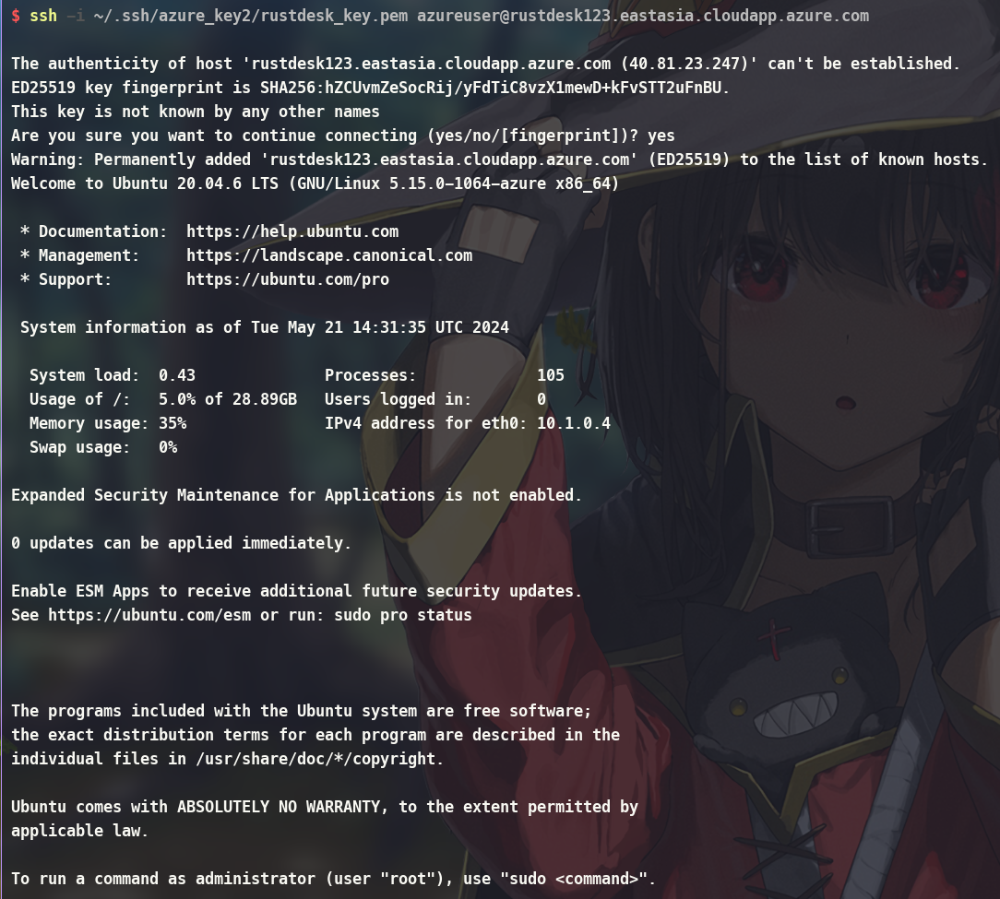

---

# Azure網路設定

---

<!-- _transition: none -->

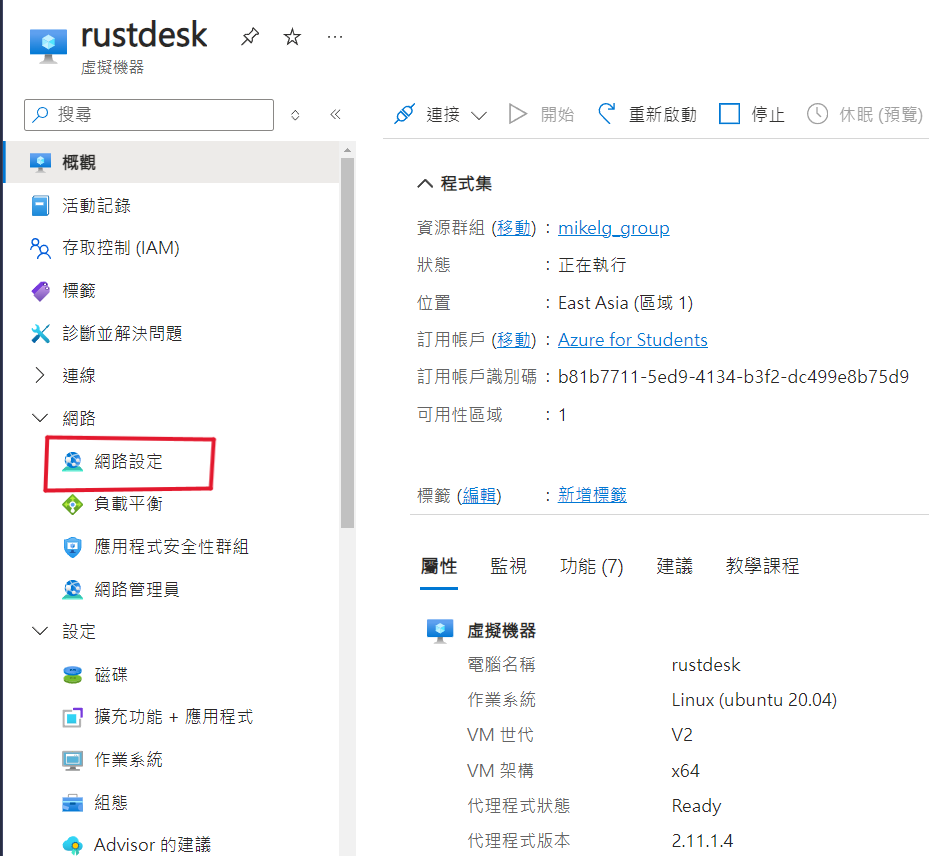

---

<!-- _transition: none -->

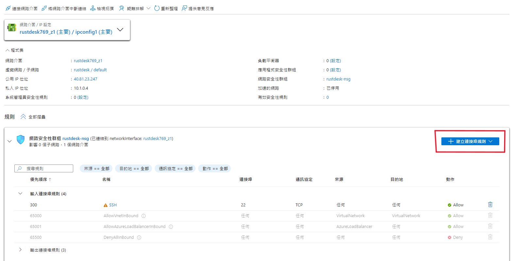

---

<!-- _transition: none -->

### 需要開放的埠號

| 埠號 | 通訊協定 |
| :--: | :----: |
| 21115-21119 | TCP |
| 21116 | UDP |

---

<!-- _transition: none -->

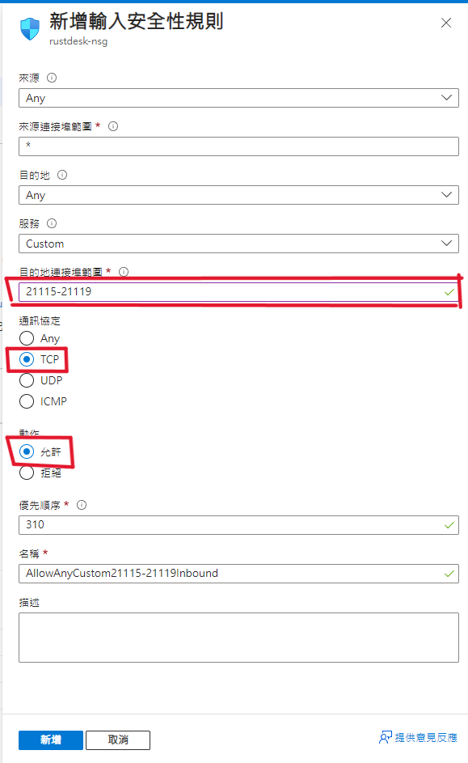

---

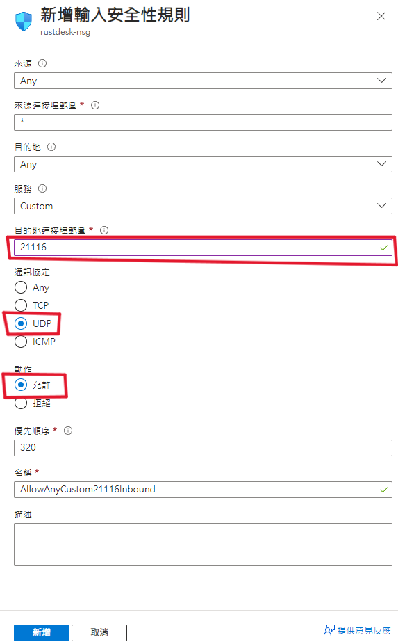

---

# Ubuntu

---

<!-- _transition: none -->

## 安裝 docker engine 

移除舊版 docker （如果存在的話）
```bash
for pkg in docker.io docker-doc docker-compose docker-compose-v2 podman-docker containerd runc; do sudo apt-get remove $pkg; done
```

---

<!-- _transition: none -->

新增 docker 的 apt repository
```bash
sudo apt update
sudo apt install ca-certificates curl
sudo install -m 0755 -d /etc/apt/keyrings
sudo curl -fsSL https://download.docker.com/linux/ubuntu/gpg -o /etc/apt/keyrings/docker.asc
sudo chmod a+r /etc/apt/keyrings/docker.asc
echo \
  "deb [arch=$(dpkg --print-architecture) signed-by=/etc/apt/keyrings/docker.asc] https://download.docker.com/linux/ubuntu \
  $(. /etc/os-release && echo "$VERSION_CODENAME") stable" | \
  sudo tee /etc/apt/sources.list.d/docker.list > /dev/null
# 上面這段指令建議一行一行複製

sudo apt update
```

---

<!-- _transition: none -->

安裝 docker
```bash
sudo apt-get install docker-ce docker-ce-cli containerd.io docker-buildx-plugin docker-compose-plugin
```

測試 docker
```bash
sudo docker run hello-world
```

---

<!-- _transition: none -->

撰寫 docker-compose.yml
```
mkdir rustdesk
cd rustdesk
vim docker-compose.yml
```

---

<!-- _transition: none -->

```yaml
version: '3'

networks:
  rustdesk-net:
    external: false

services:
  hbbs:
    container_name: hbbs
    ports:
      - 21115:21115
      - 21116:21116
      - 21116:21116/udp
      - 21118:21118
    image: rustdesk/rustdesk-server:latest
    command: hbbs -r rustdesk123.eastasia.cloudapp.azure.com:21117
    volumes:
      - ./data:/root
    networks:
      - rustdesk-net
    depends_on:
      - hbbr
    restart: unless-stopped

  hbbr:
    container_name: hbbr
    ports:
      - 21117:21117
      - 21119:21119
    image: rustdesk/rustdesk-server:latest
    command: hbbr
    volumes:
      - ./data:/root
    networks:
      - rustdesk-net
    restart: unless-stopped
```

---

<!-- _transition: none -->

啟動 RustDesk Server
```
sudo docker compose up -d
```

---

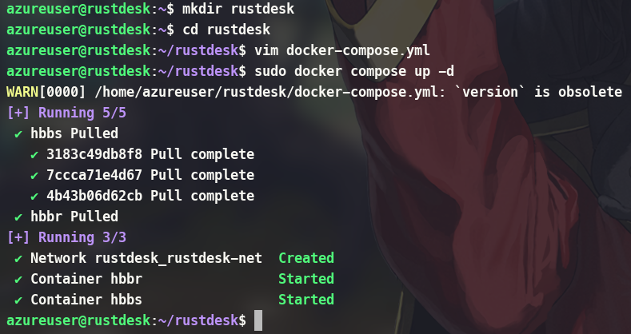

---

<!-- _transition: none -->

## 設定防火牆 

---

允許下列埠號：
```bash
sudo ufw allow 22
sudo ufw allow 21115:21119/tcp
sudo ufw allow 21116/udp
sudo ufw enable
```

---

### 設定 RustDesk Client

---

<!-- _transition: none -->

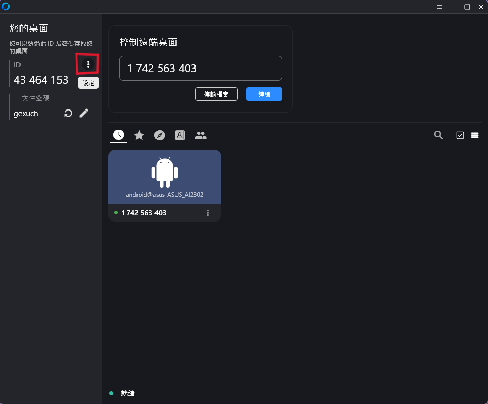

---

<!-- _transition: none -->

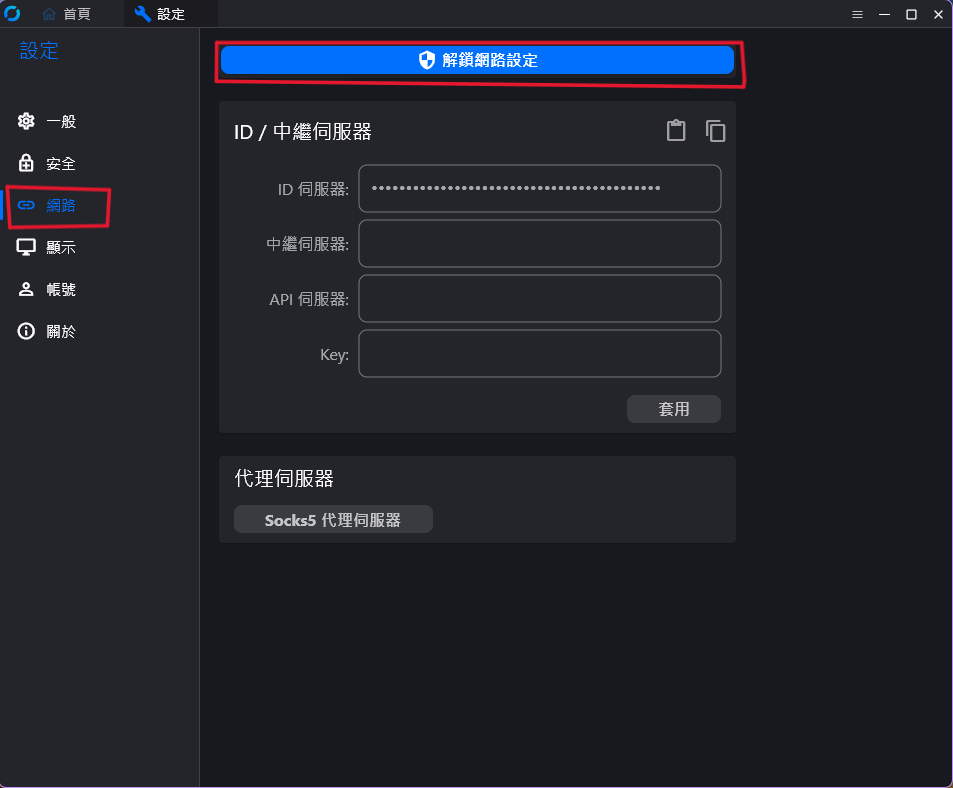

---

<!-- _transition: none -->
<!-- _class: invert lead -->

輸入
伺服器IP:21116
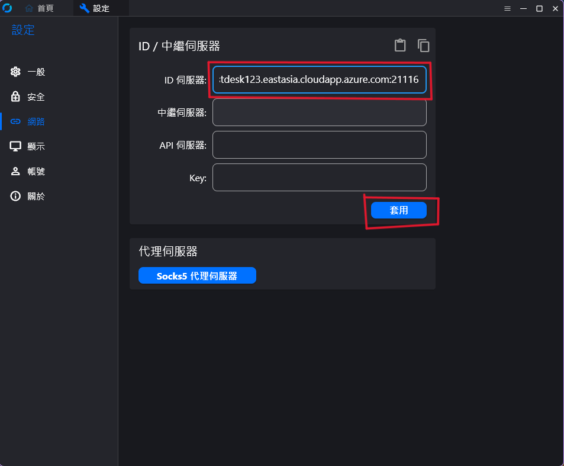

---

<!-- _transition: none -->
<!-- _class: invert lead -->

**就緒**
表示成功
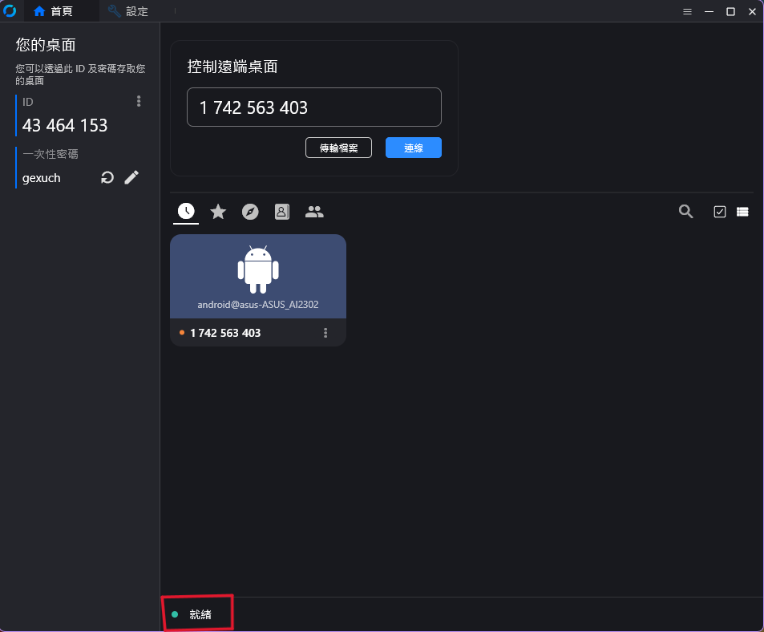

---

<!-- _transition: none -->
<!-- _class: invert lead -->

輸入密碼
即可連線
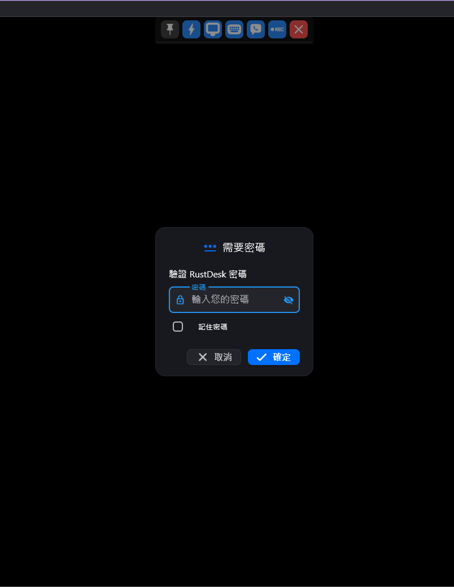

---

<!-- _transition: none -->

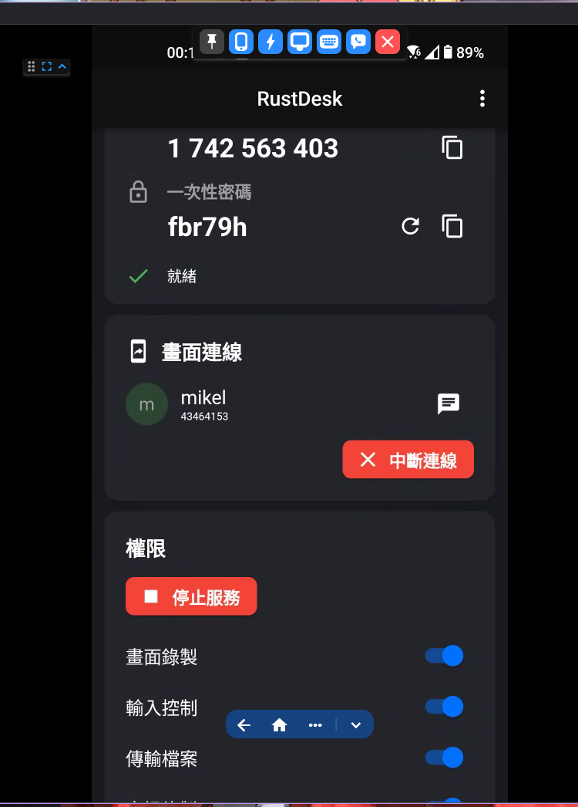


---

<!-- _transition: none -->

#### 題外話

這份 PPT 使用 `marp cli` 製作


`marp cli` 可使用 markdown 檔案製作簡報
可匯出為 `html` 、 `pdf` 甚至是 `pptx`
非常方便

---

<!-- _transition: none -->

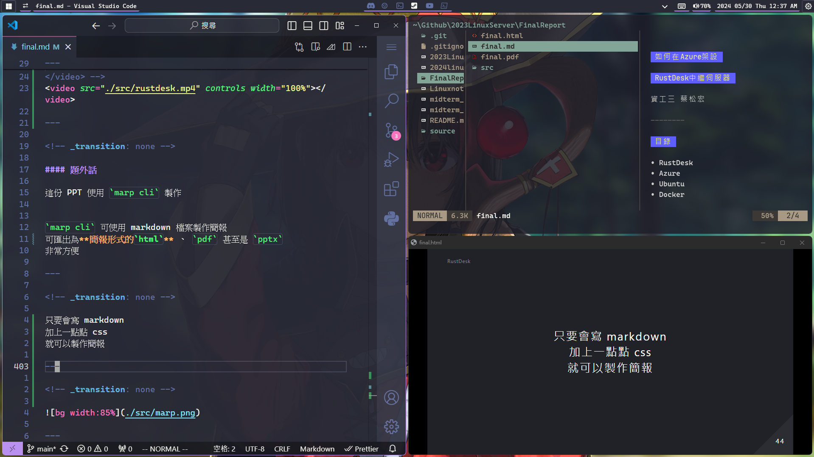

---

<!-- _transition: swoosh -->

# 參考資料

- [RustDesk](https://rustdesk.com/)
- [開源遠端桌面存取軟體 RustDesk](https://ithelp.ithome.com.tw/articles/10341212)
- [Install Docker Engine on Ubuntu](https://docs.docker.com/engine/install/ubuntu/)
- [marp-cli](https://github.com/marp-team/marp-cli?tab=readme-ov-file)
- [marpit](https://marpit.marp.app/)

---

# END